### プロセスとは

`メモリ上で実行状態にあるプログラム`のこと

- psコマンド - プロセスの表示


- 現在のターミナル以外のプロセスも表示する


- オプション形式


- 全てのプロセスを表示


`Linuxはマルチタスク機能により、様々なプロセスが同時に動作している`

- よく使われるオプション


### ジョブとは

`シェルから見た処理の単位のこと`


- コマンドを一時停止する


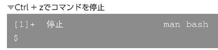

- fgコマンド - ジョブをフォアグラウンドにする

ジョブを停止状態から、ユーザーが対話的に操作できる元の状態に戻す
これをフォアグラウンドという
```
fg %<ジョブ番号>
```


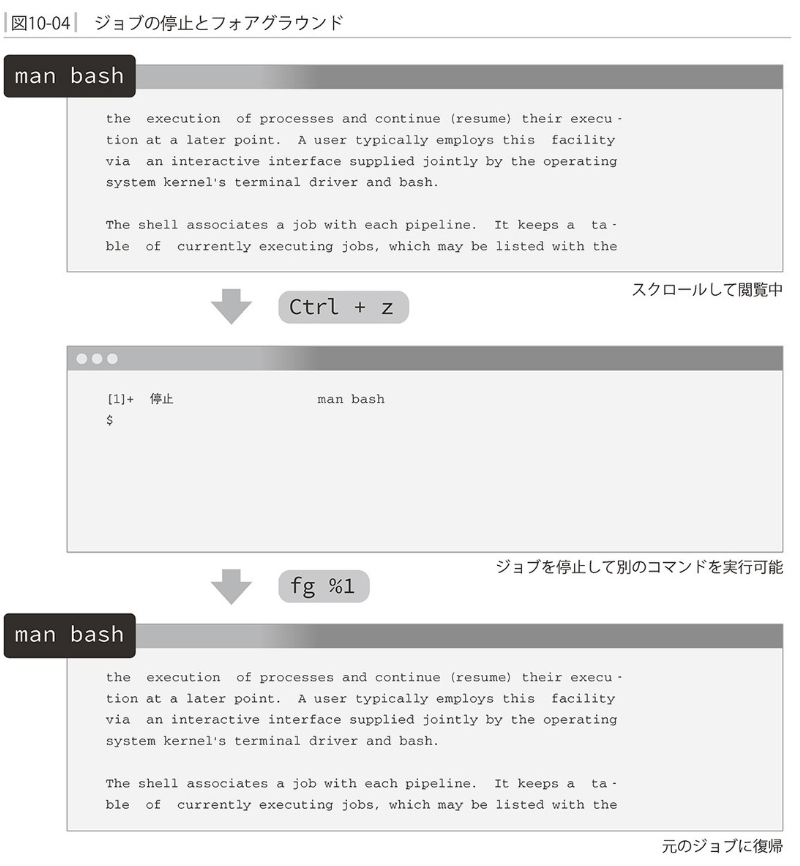

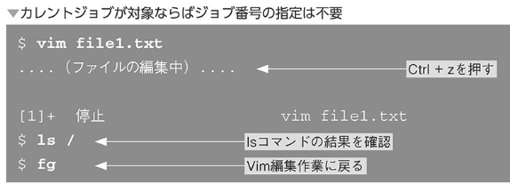


- bgコマンド - ジョブをバックグラウンドにする


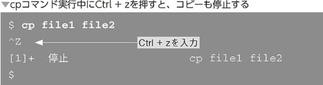

　以上の場合はバックグラウンドで処理を継続したままシェルへ戻ってこれると便利

```
bg %<ジョブ番号>
```

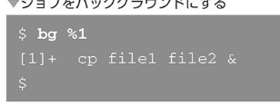


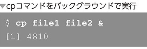

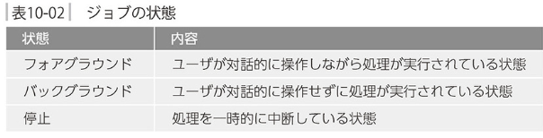

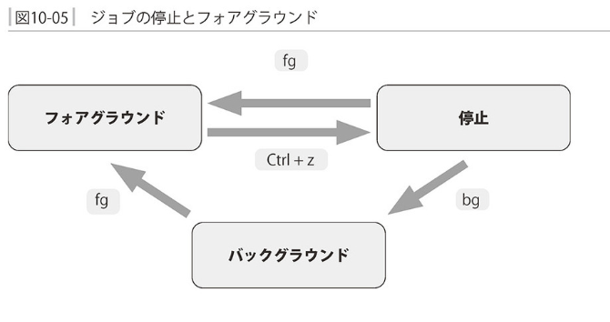

### ジョブ・プロセスの終了

フォアグラウンドジョブの終了
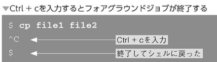
上はバックグラウンドジョブは停止できない

```
kill %<ジョブ番号>
```

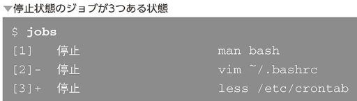

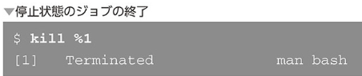

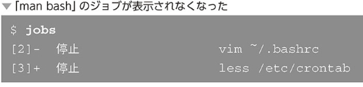

- プロセスの終了

```
kill <プロセス　ID>
```

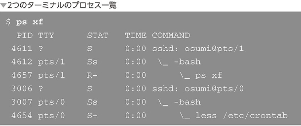

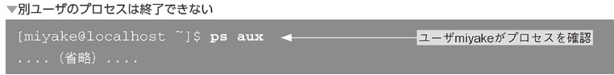
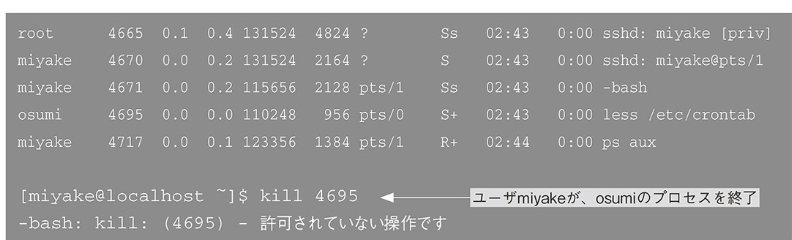

- killコマンド - シグナルを送信する

`killはコマンドではなくシグナルを送信するコマンド`

下記は全て同じ意味
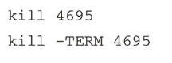
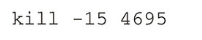

