### 標準入力、標準出力、標準エラー出力
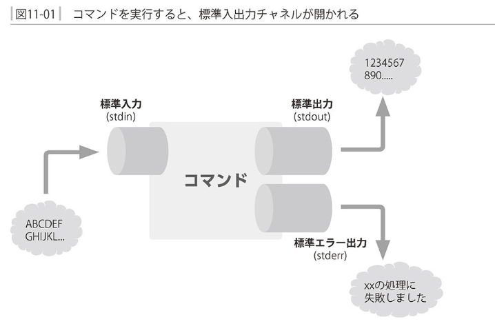

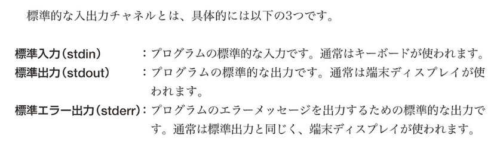


### リダイレクト

- 表中入力のリダイレクト

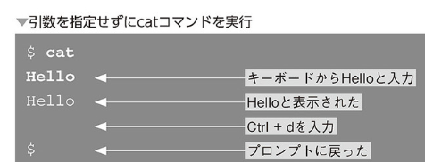

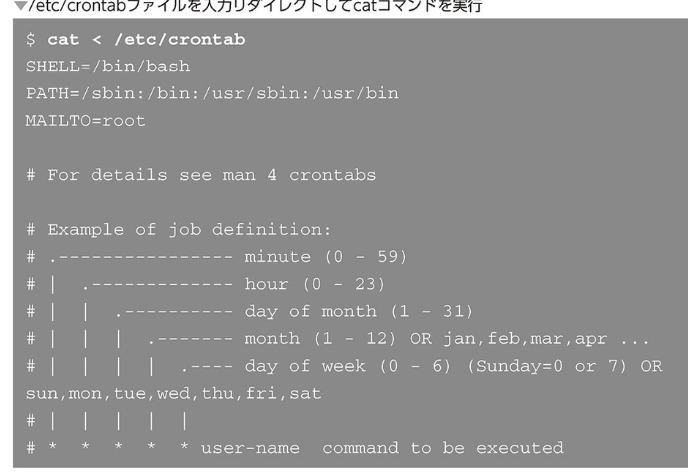

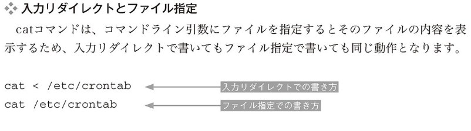

- 標準出力のリダイレクト

コマンドの実行結果を画面でなくファイルに保存したい場合


- 標準エラー出力
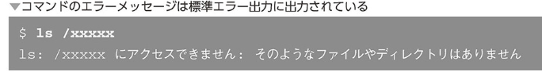

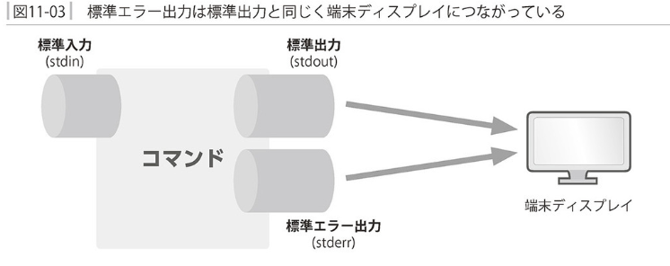

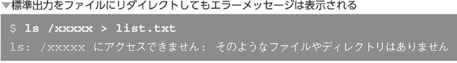

`標準出力とエラー出力は別々のチャネルになっている`


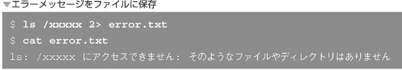

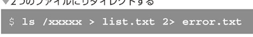

標準出力と標準エラー出力をまとめる

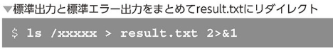

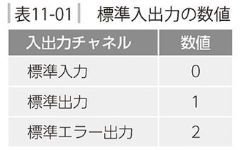


- リダイレクトによる上書き
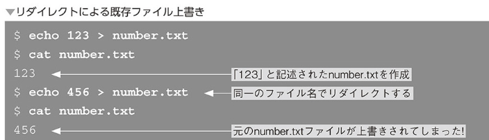

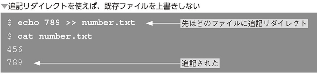

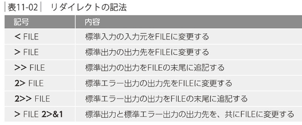

- /dev/null

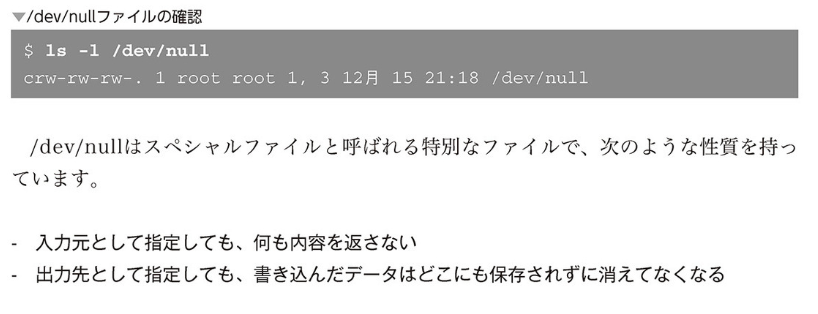


### パイプライン

`コマンドの標準出力を別のコマンドの標準入力に繋げる`

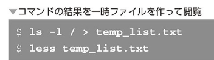

```
<コマンド1>| <コマンド2> | <コマンド3>
```

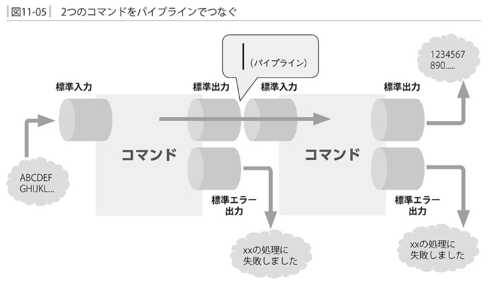

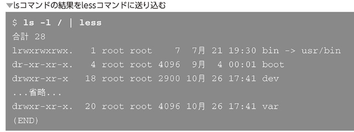

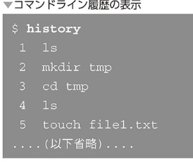

コマンドライン履歴をlessで読む
```
$ history | less
```

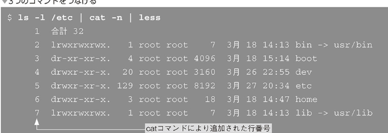

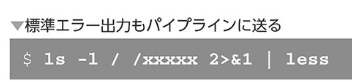

### フィルター

- フィルタの例 - headコマンド

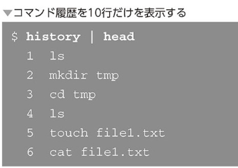

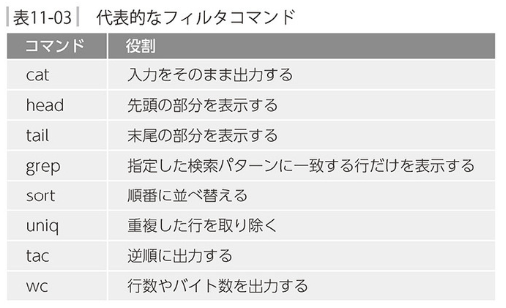


- コマンドの組み合わせ例
```
du [オプション] [ファイル/ディレクトリ]
```

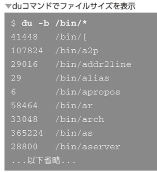

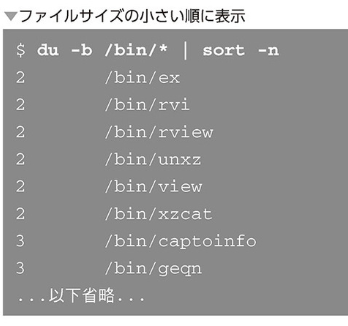

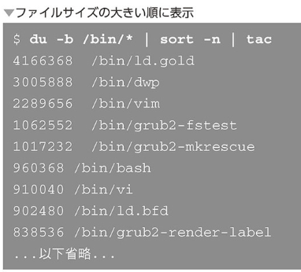

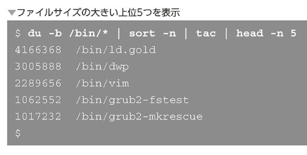

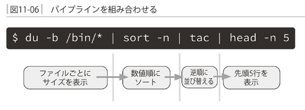

