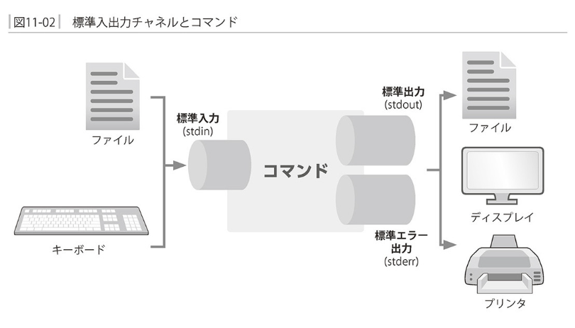
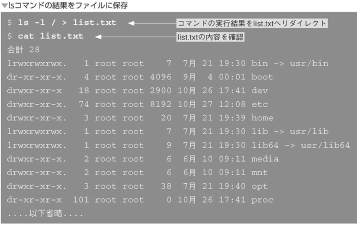
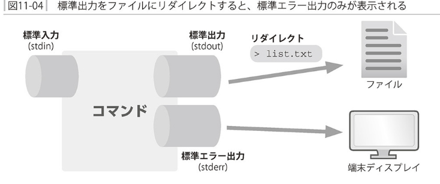

### 標準入力、標準出力、標準エラー出力




### リダイレクト

- 表中入力のリダイレクト


- 標準出力のリダイレクト

コマンドの実行結果を画面でなくファイルに保存したい場合



- 標準エラー出力


`標準出力とエラー出力は別々のチャネルになっている`




標準出力と標準エラー出力をまとめる


- リダイレクトによる上書き


- /dev/null


### パイプライン

`コマンドの標準出力を別のコマンドの標準入力に繋げる`


```
<コマンド1>| <コマンド2> | <コマンド3>
```


コマンドライン履歴をlessで読む
```
$ history | less
```


### フィルター

- フィルタの例 - headコマンド


- コマンドの組み合わせ例
```
du [オプション] [ファイル/ディレクトリ]
```


