### wcコマンド

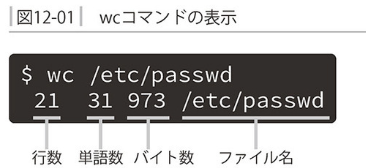

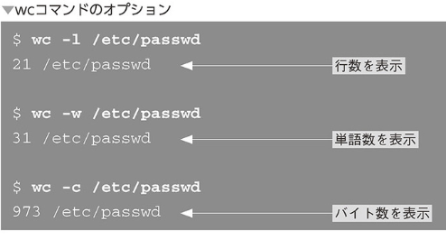

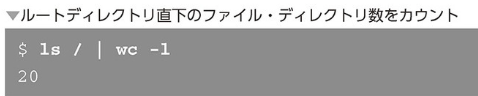

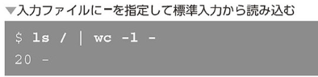

### sortコマンド

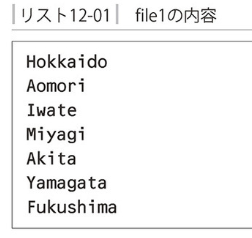

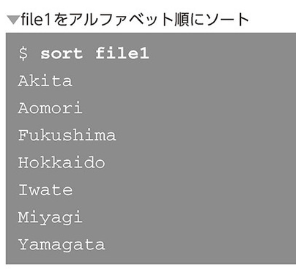

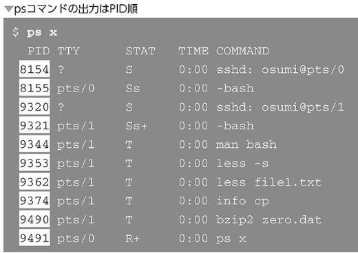

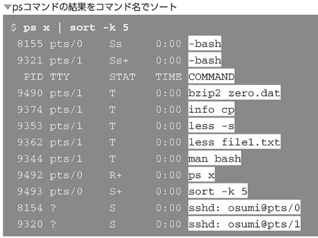

- 数値順にソート

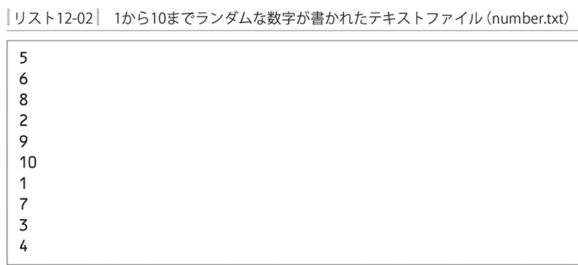

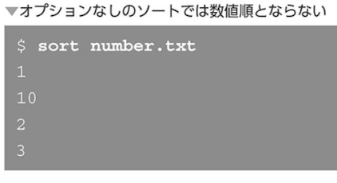

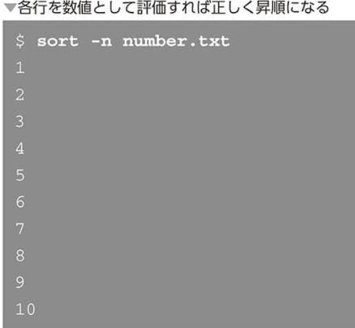

- 逆順にソート

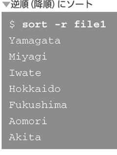

### uniqコマンド

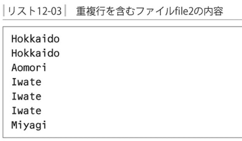

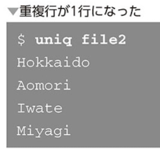

`重複行が連続している場合のみ取り除ける！`

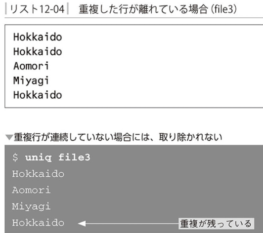

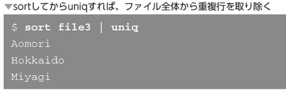

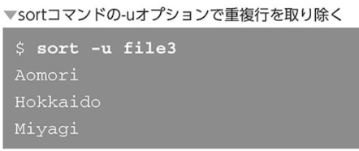

- 重複行を数える

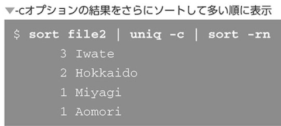

`-cオプションは重複行を数えて数値を表示`

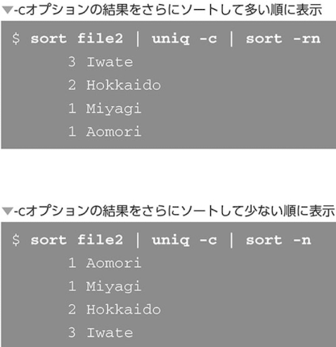

### cutコマンド

入力の一部を切り出して表示

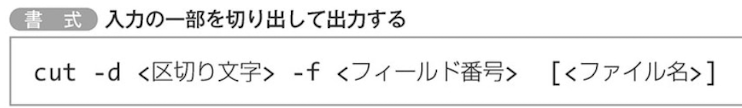

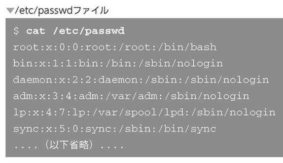

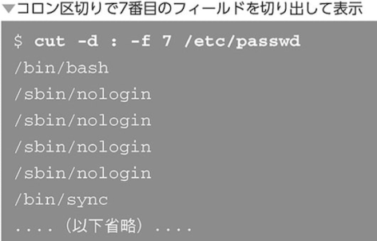

### trコマンド

文字を変換・削除

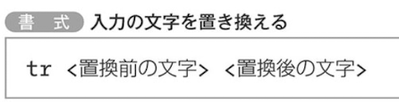

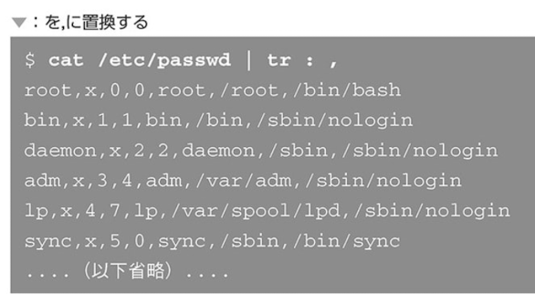

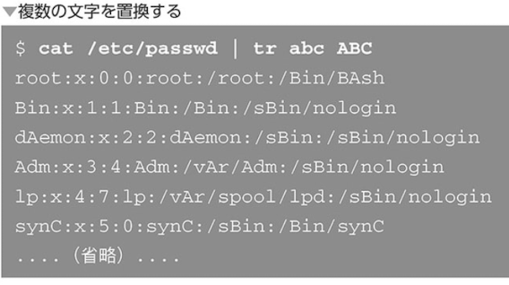

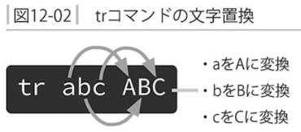

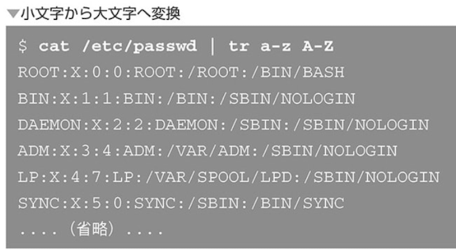

- trコマンドはファイルから直接読み込むことはできない

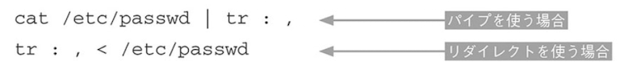

- 文字の削除

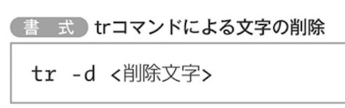

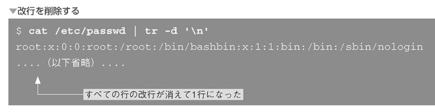

### tailコマンド

`末尾部分を表示する`

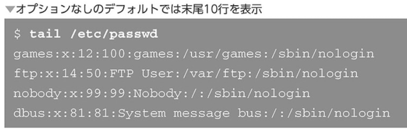

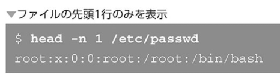

- tailコマンドでファイルへの追記を監視する

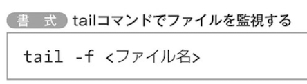

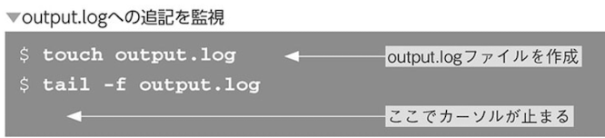

`ログのリアルタイム表示`

### diffコマンド

`差分を表示する`

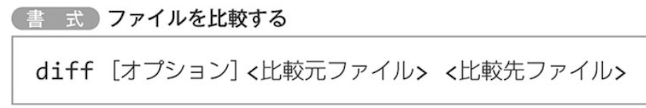

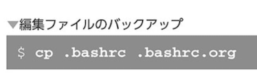

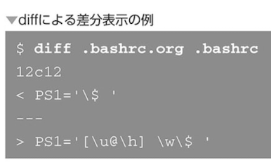

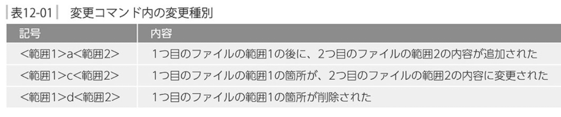

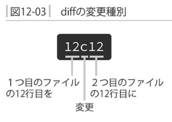

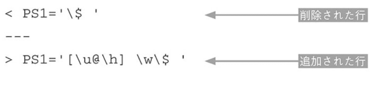

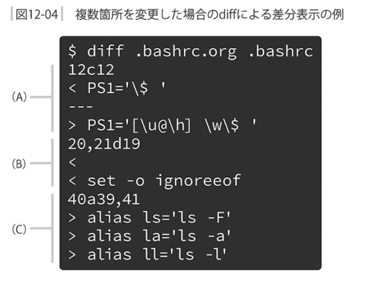

- ユニファイド出力形式

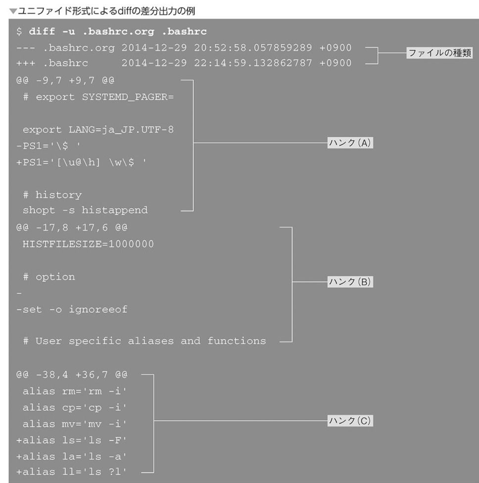

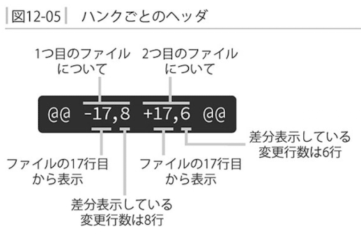

