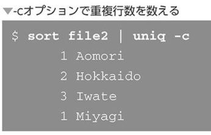

### wcコマンド

### sortコマンド

- 数値順にソート

- 逆順にソート

### uniqコマンド

`重複行が連続している場合のみ取り除ける！`

- 重複行を数える

`-cオプションは重複行を数えて数値を表示`

### cutコマンド

入力の一部を切り出して表示

### trコマンド

文字を変換・削除

- trコマンドはファイルから直接読み込むことはできない

- 文字の削除

### tailコマンド

`末尾部分を表示する`

- tailコマンドでファイルへの追記を監視する

`ログのリアルタイム表示`

### diffコマンド

`差分を表示する`

- ユニファイド出力形式

