### grepコマンドと正規表現

文字列を検索する

```
grep [オプション] <検索パターン> <ファイル名>
```

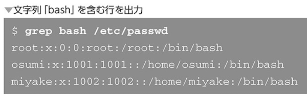

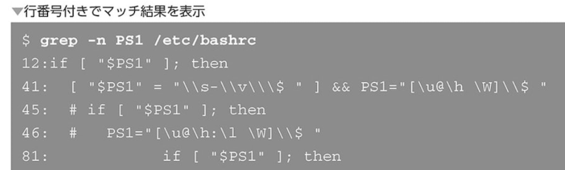

条件とマッチしない行を表示する場合は-vオプション

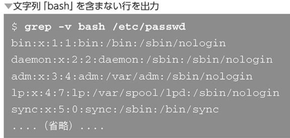

別のコマンドの結果をgrepで表示

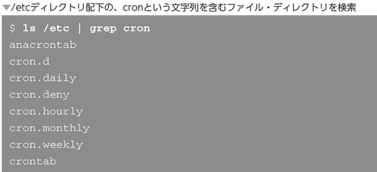

- 正規表現って何？

条件にマッチする文字列集合を表現する記法

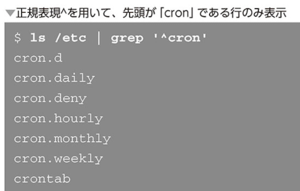

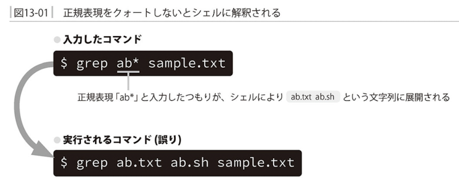

### 文字列にマッチするメタ文字

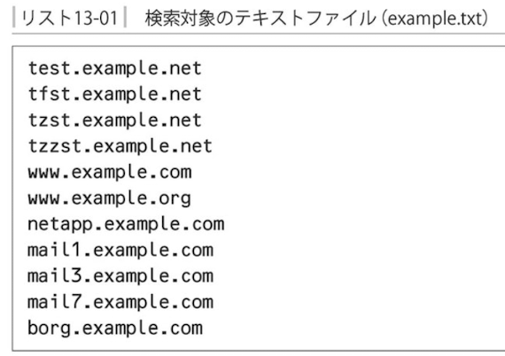

`t.st`というパターンで検索

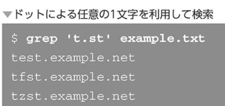

`t..st`と書くと任意の２文字になる

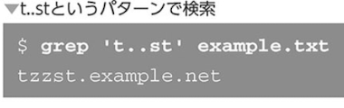

.そのものにマッチさせる
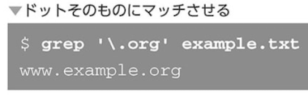

- 特定の文字を指定する

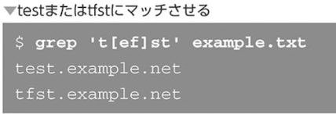

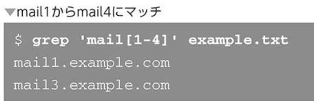

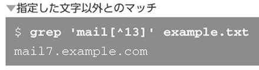

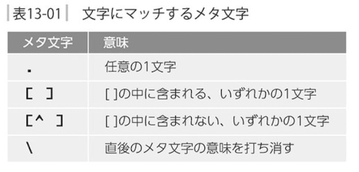

### 位置にマッチするメタ文字

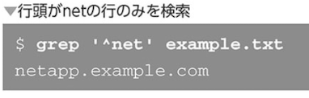

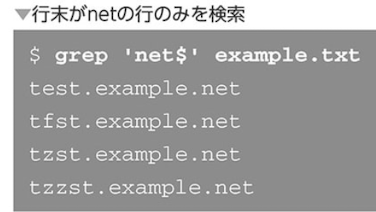

### 繰り返しを指定するメタ文字

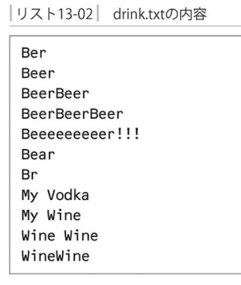

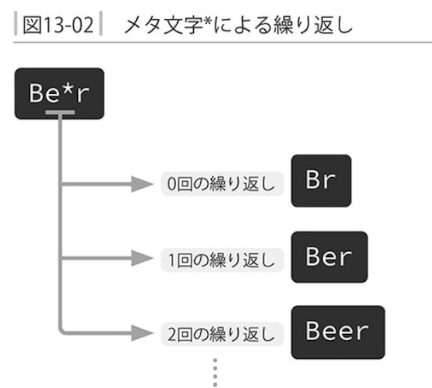


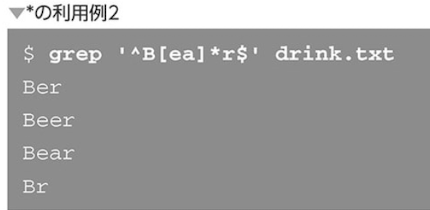

- 拡張正規表現とは

`-Eオプションを利用すると、拡張正規表現として解釈される`
拡張正規表現とはメタ文字を増やしたもの

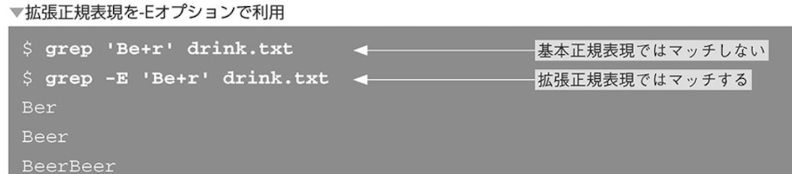

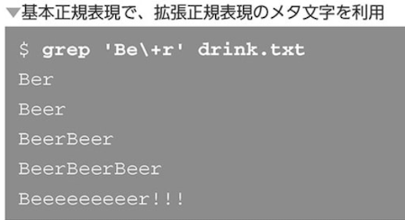

- 拡張正規表現による繰り返し回数の指定

`直前の文字は少なくとも一つは必要`

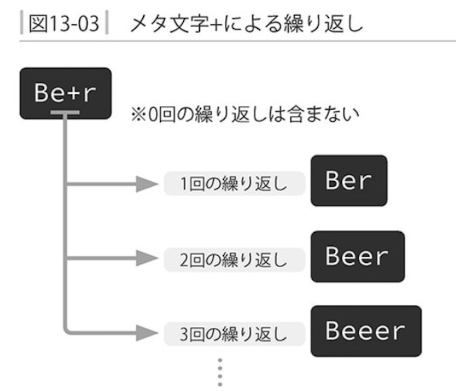


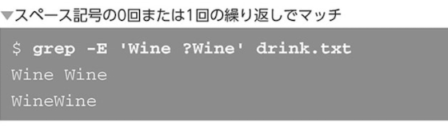

- 繰り返し回数を指定するメタ文字

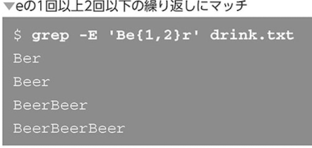

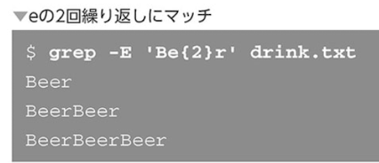


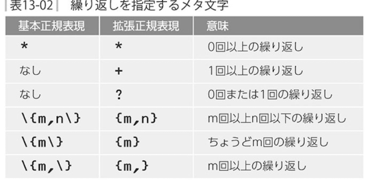

- その他のメタ文字

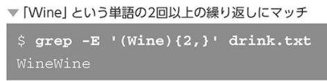

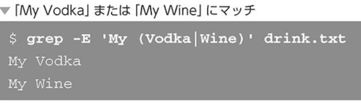

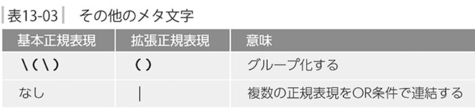

### 正規表現の利用

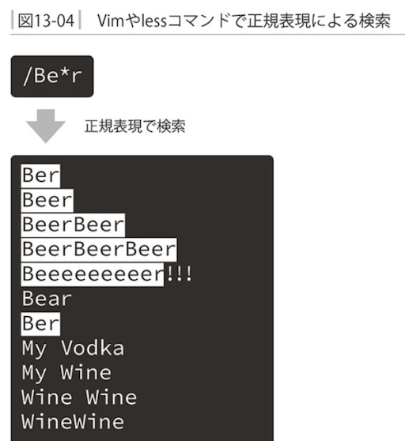

