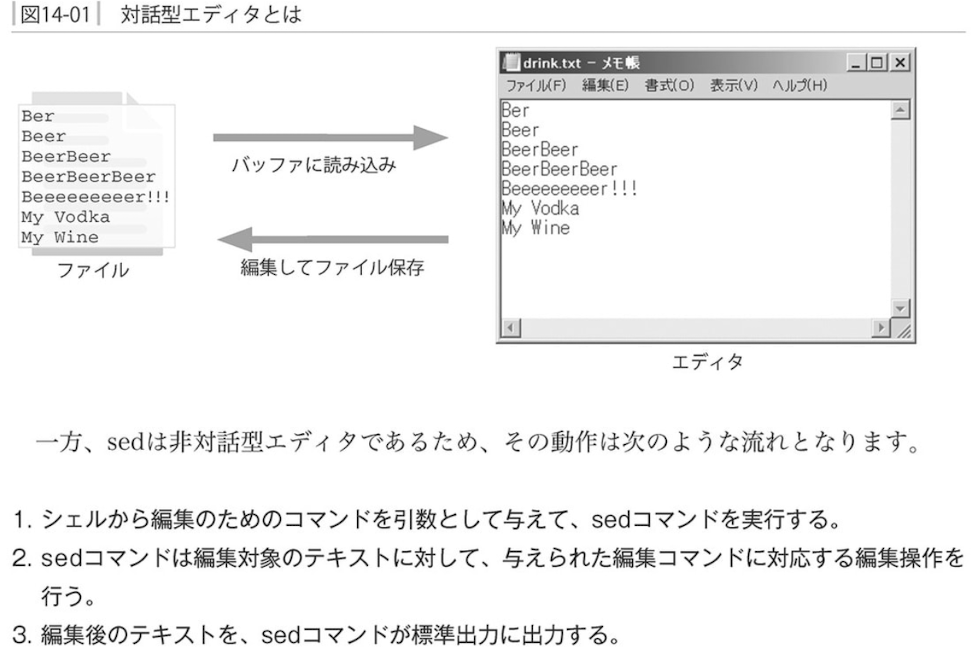
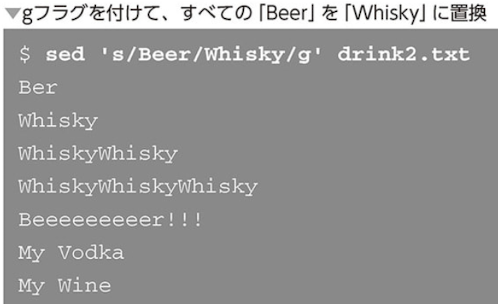
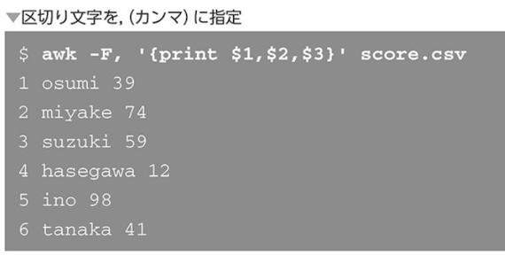

### sedコマンド

- 非対話型エディタとは




- sedコマンドの形式


`行を削除するd`
`行を表示するp`
`行を置換するs`

- 行を削除する


全行の削除は`d`

正規表現は下記


- 行を表示する


- 行を置換する


`見つかった全ての文字列を置換するにはgコマンド`




`置換後文字列を指定しない場合は空文字となる`


- 後方参照

`マッチした文字列を置換後に埋め込みたいケース`


### awkコマンド

パターン検索・処理言語
- awkコマンドの形式

```
パターン { アクション }
```


- prontとフィールド変数

特定のフィールドを抽出して表示するという列選択


- パターン指定


- アクションの省略


- 実践例 csvファイルからスコア集計





