### シェルスクリプトとは

- どのシェルスクリプトを書くべきかについては、「bash」が互換性・移植性が高く書く上で便利な機能が多く備わっている

### シェルスクリプトを作成する

以下のようなコマンドラインを利用

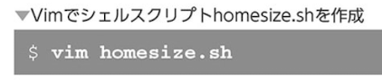

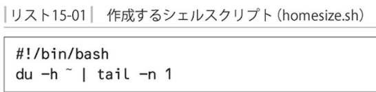

`シェルスクリプトには必ず実行権限をつける`

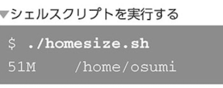

`ファイル名の前に./をつけること`

### シェルスクリプトの実行形式

- シバン

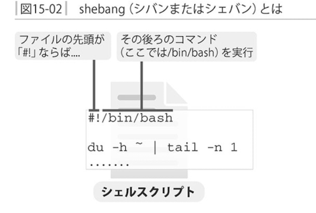

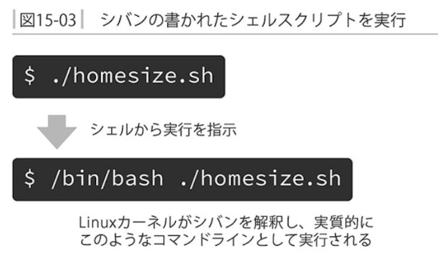

- sourceコマンド - ファイルからコマンドを読み込んで実行する

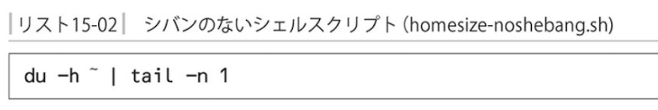

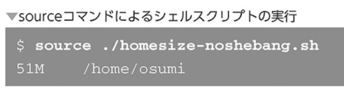

sourceコマンドは指定したファイル内容をそのままコマンドラインに入力した時と同じように実行

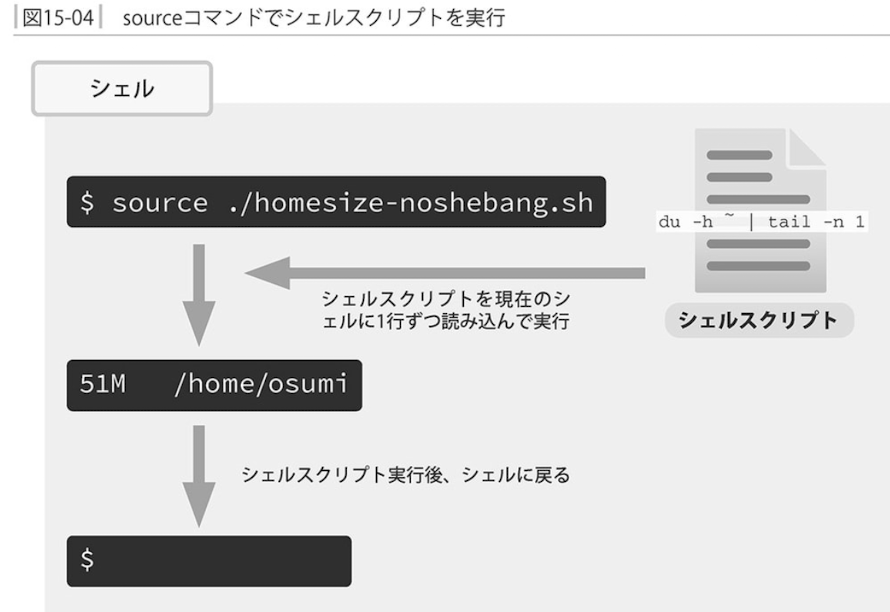

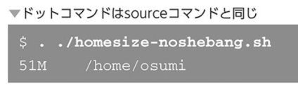

- 実行方法により違い

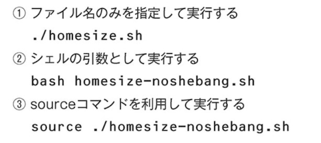

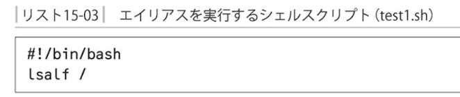

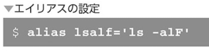

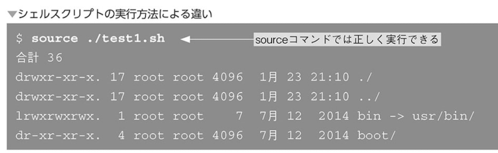

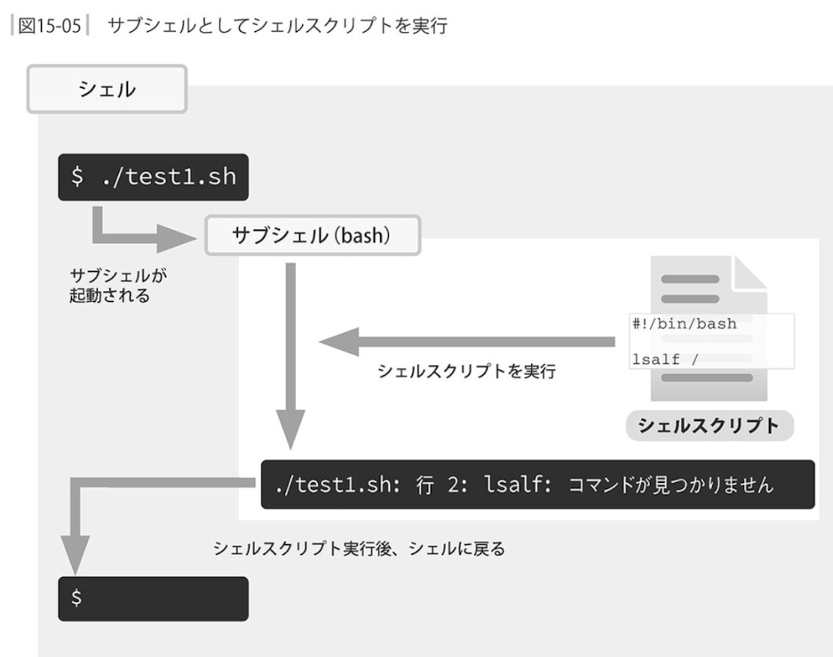

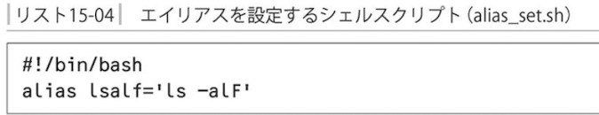

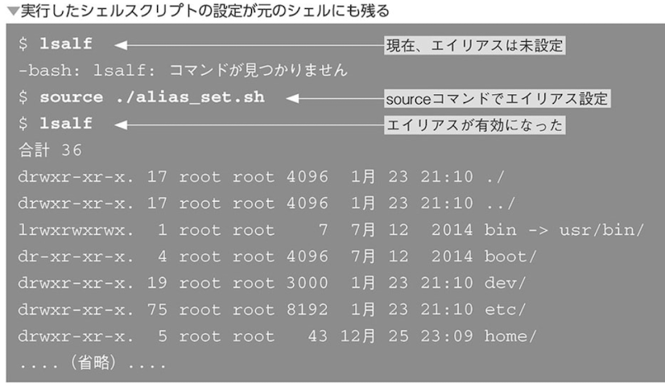

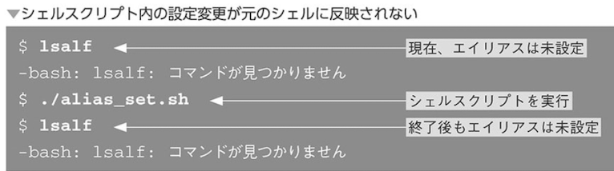

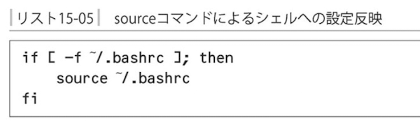

### シェルスクリプトを配置する

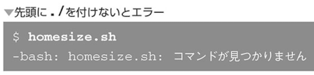

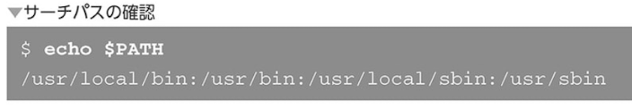

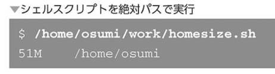

- 自分のシェルスクリプト置き場を作る

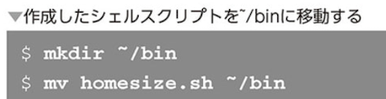

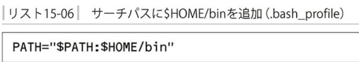

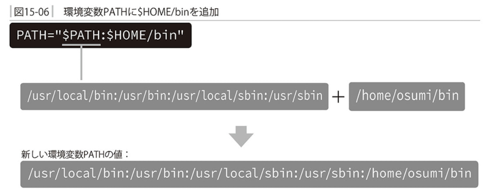

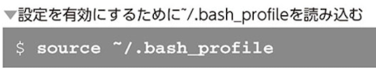

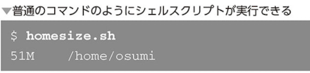

- sourceコマンドとパス

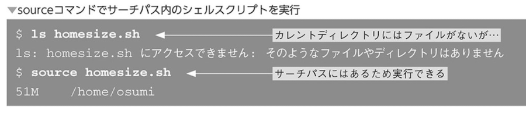

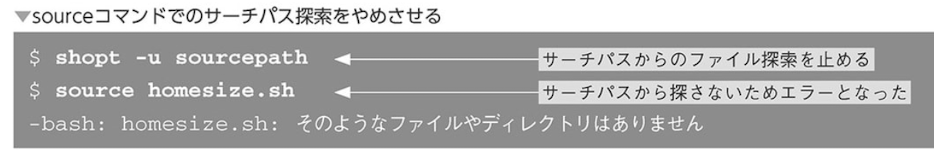

