### シェルスクリプトの基礎知識

- シェルスクリプトの行


- 複数行での記述


シェルでの複数行のい記入
以下の状態は「まだコマンドラインが終了していないので入力してください」という状態
これを`セカンダリプロンプト`という


- コメント

「#」を書くとその行をコメントとすることができる


### 変数

通常のプログラムと同じように変数を利用でき、これをシェル変数という。

`変数を参照するには変数名の前に「$」をつける`


- 変数の書き方の注意

`変数に代入時に$は付けない。値を参照したい時だけ`

`=の前後にスペースを入れない`

`変数名に利用できる文字はアルファベットと数値と_(アンダースコア)だけ`

`変数名の区切りを明示する。{}で明示できる`


### クォーティング

`''`か`""`で囲むことによって`スペースも含めて１つの単語とみなされるよう`にできる


クォーティングすることでシェルによるスペースやメタ文字の解釈をさせず、まとめて一つの文字列として扱うことができる

- クォート中の変数展開


### コマンド置換

コマンド置換を利用すれば、コマンドの結果を文字列として取得する


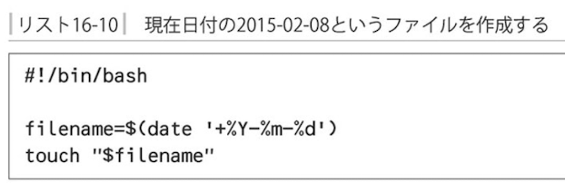

ダブルクォートでの記法

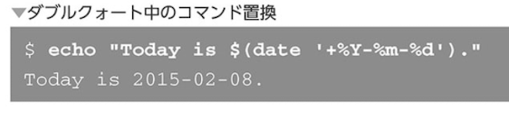

バックコートでの記法

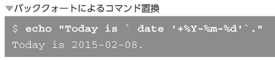

### 位置パラメーター

シェルスクリプトからコマンドライン引数を扱う

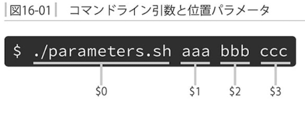

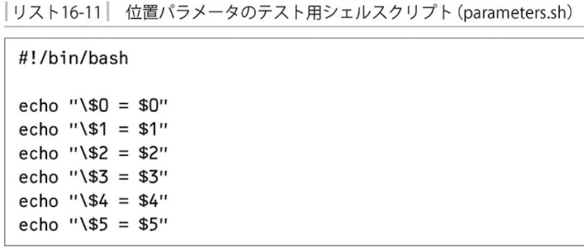

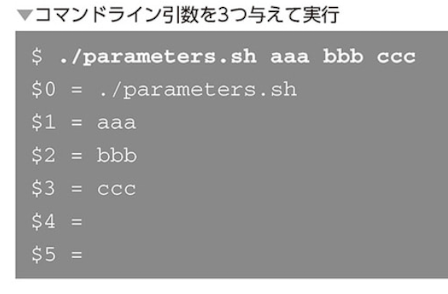

*を使用するとファイル名が位置パラメーターとして表示される

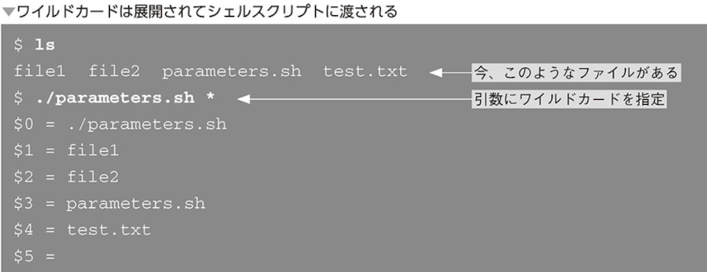


- 引数の個数

引数の個数は特殊パラメーター$#という変数で参照できる

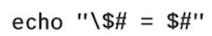

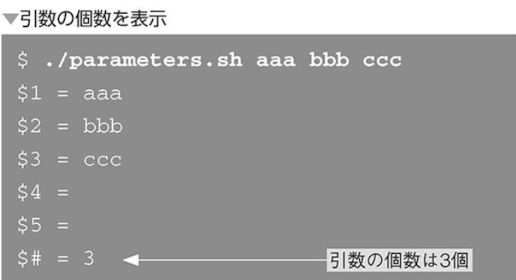

- 引数全体の参照

`引数を分割させずにまとめて扱うには$@または$*を使う`

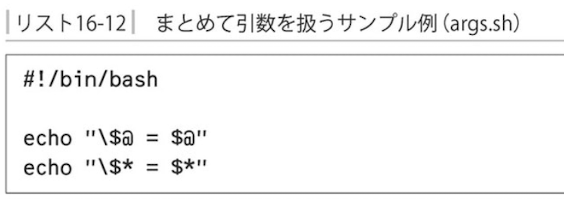

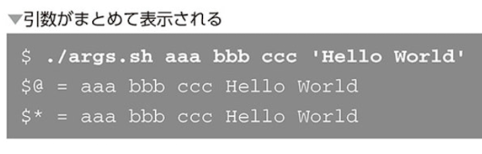

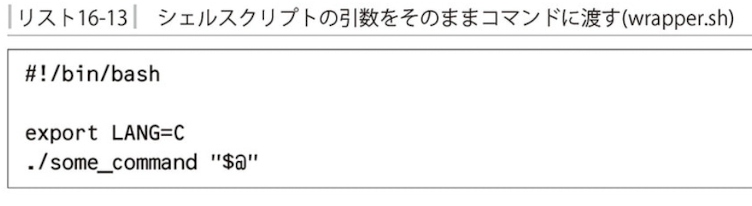

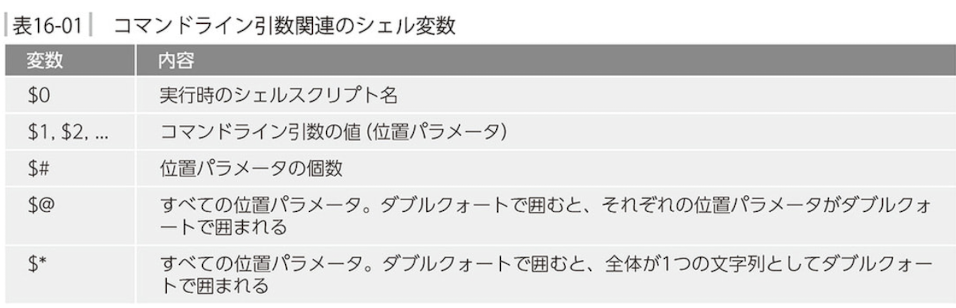

### 制御構造

- if文

条件を評価してその真偽に応じて処理を分岐する

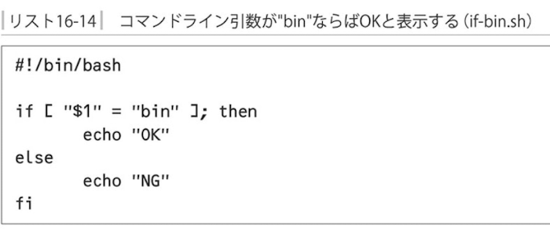

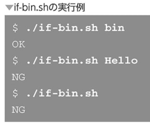

- 記述上の注意点

セミコロンなしの場合はエラー

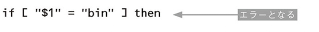

セミコロンなしでどうしても描きたい場合

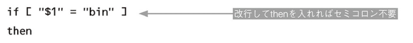

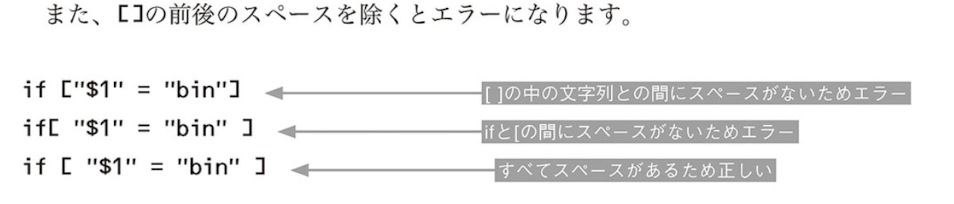

if文の後ろにはコマンドを書く

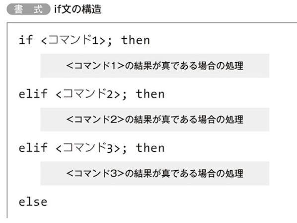

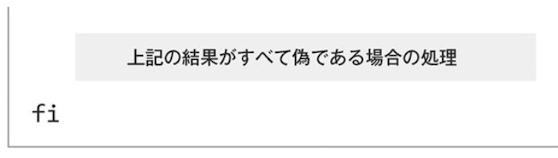

`ちなみに[]はカッコではなくbashのコマンドである`

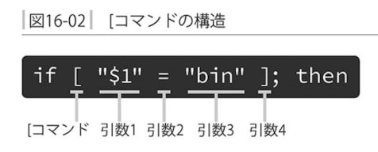

- コマンドと終了ステータス

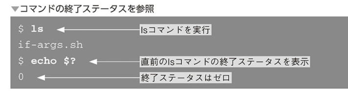

終了した場合は0、エラー時は0以外

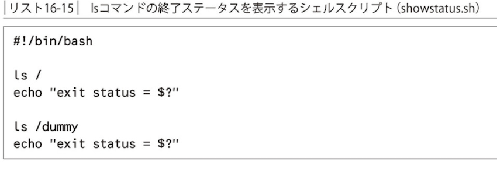

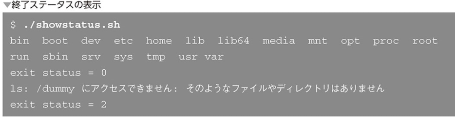

- if文と終了ステータス

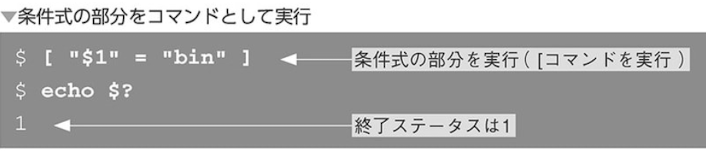

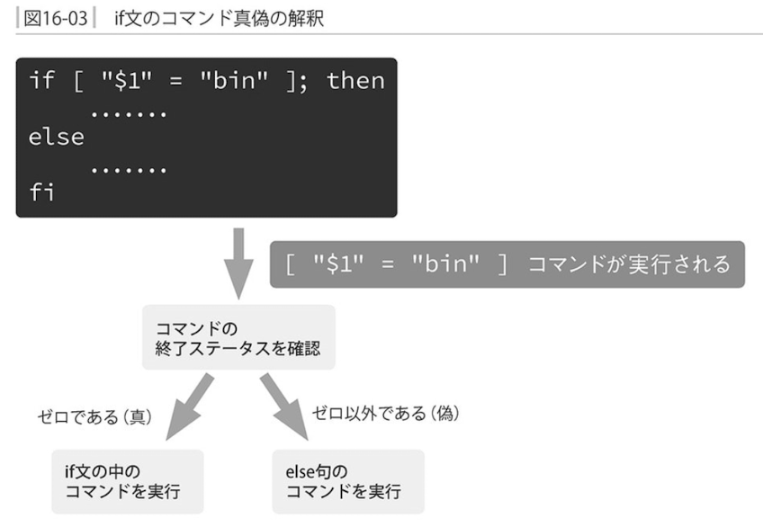

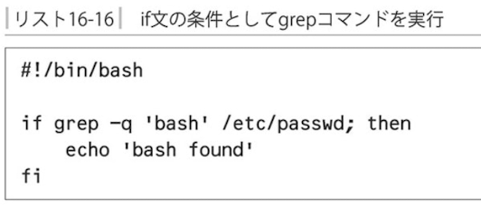

- testコマンドと演算子

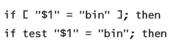

- 文字列の比較

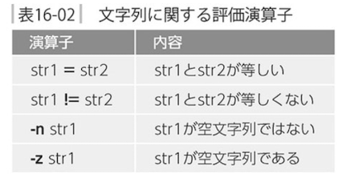

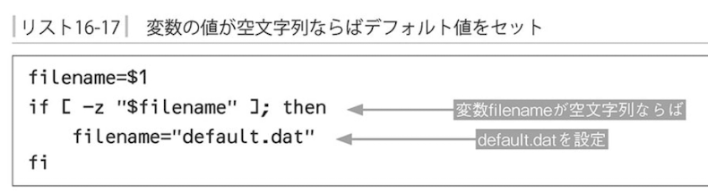

- 整数の比較

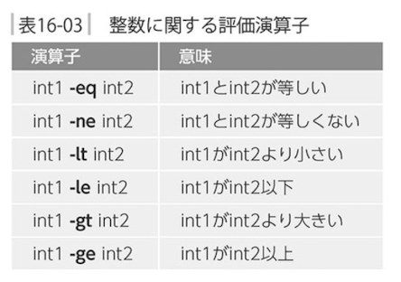

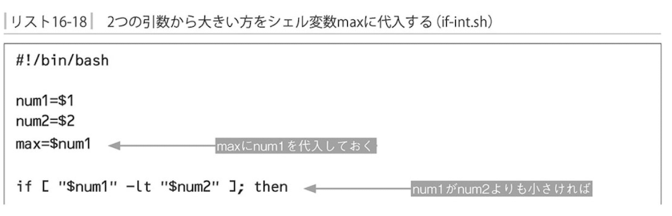

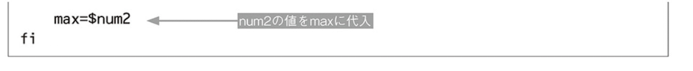


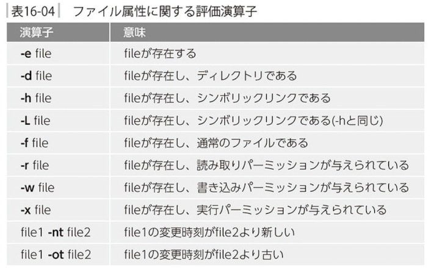

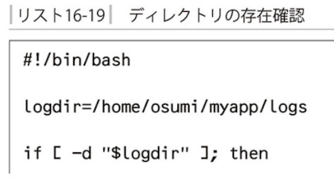

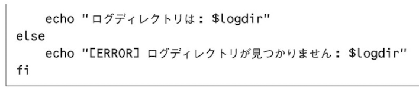

- 演算子の結合

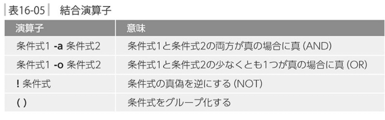

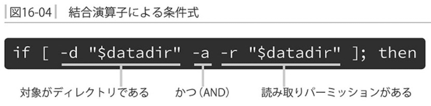

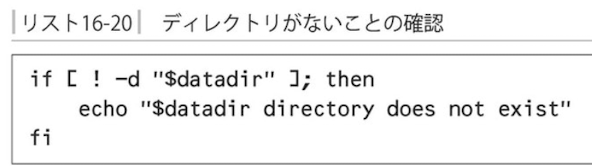

()で囲むと条件をグループ化できる

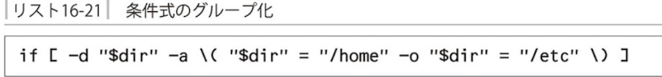

- &&と||

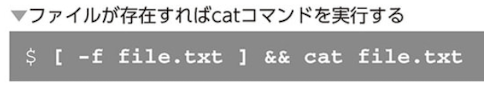


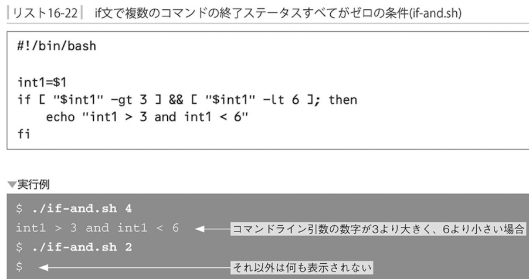

if文では&&はand条件となる

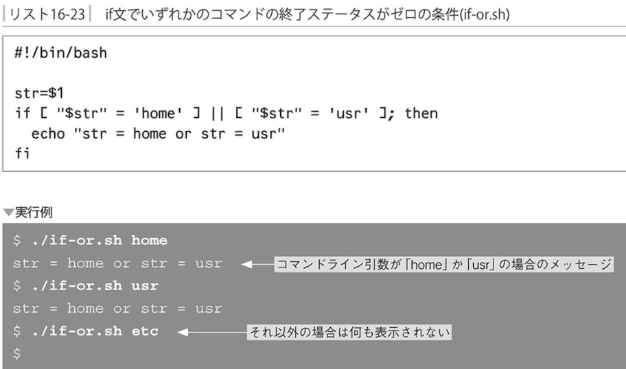

逆に||はor条件となる

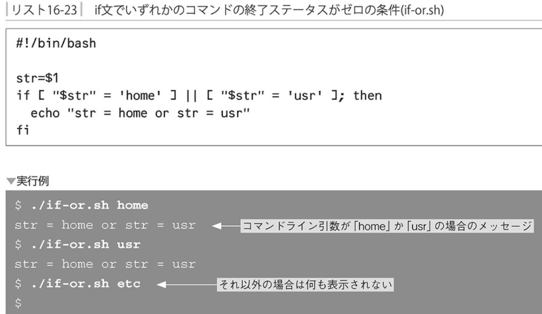

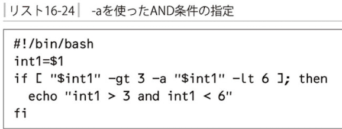

- シェルスクリプトの終了ステータス

シェルスクリプトの中で最後に実行したコマンドの終了ステータスがシェルスクリプトの終了ステータスとなる

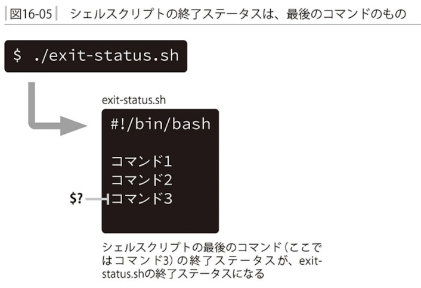

```
exit <終了ステータス>
```

シェルスクリプトが別のプログラムから呼び出された際にエラー処理を行わせることができる

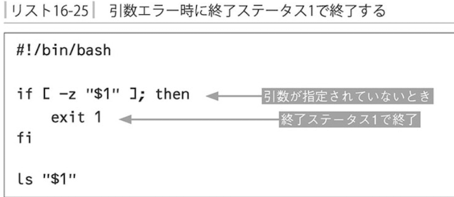

- 演習1


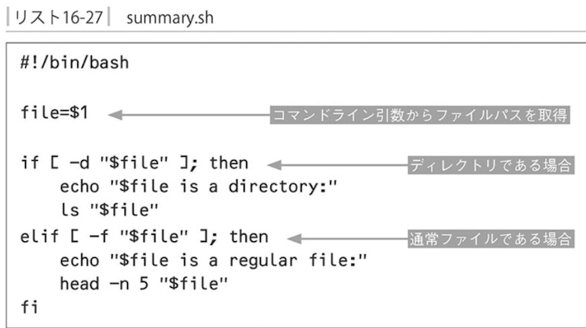

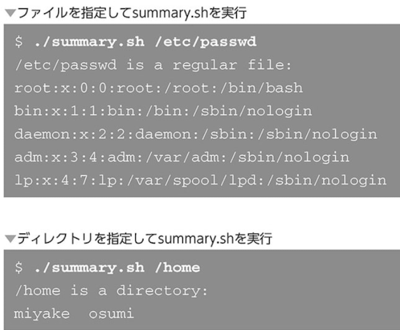

- for文

単語のリストに対して繰り返し処理を行う構文

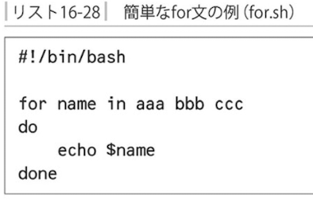


```
seq <開始値> <終了値>
```


- case文

`指定された文字列がパターンにマッチするか判断しマッチしたパターン対応する処理を行う`


- while文

`指定した条件が真である限り繰り返し処理を行う`


- 算術展開


bashの算術式展開は読みやすく動作が早い

### シェル関数


`関数は上のように利用する場所よりも前に定義しておかなければならない`

- シェル関数内での位置パラメーター


- シェル関数の終了ステータス

```
return <終了ステータス>
```


