### シェルスクリプトの基礎知識

- シェルスクリプトの行

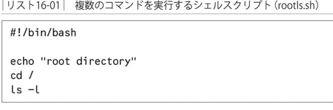

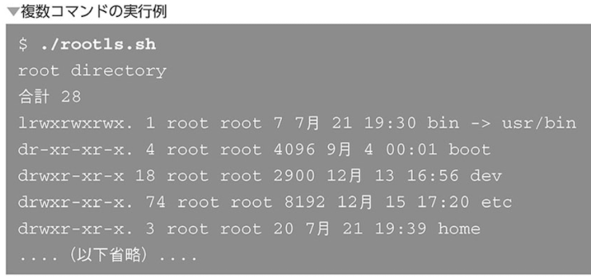

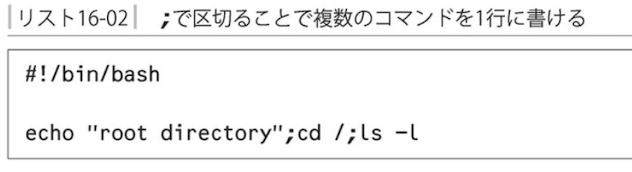

- 複数行での記述

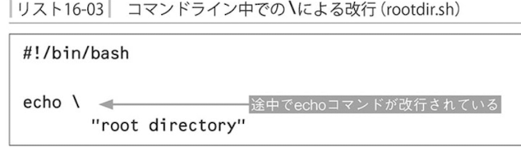

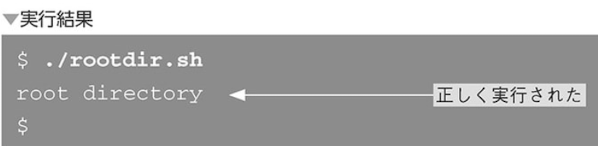

シェルでの複数行のい記入
以下の状態は「まだコマンドラインが終了していないので入力してください」という状態
これを`セカンダリプロンプト`という

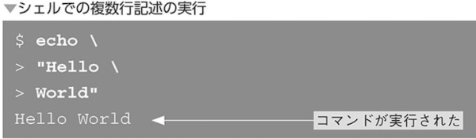

- コメント

「#」を書くとその行をコメントとすることができる

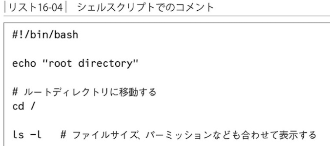

### 変数

通常のプログラムと同じように変数を利用でき、これをシェル変数という。

`変数を参照するには変数名の前に「$」をつける`

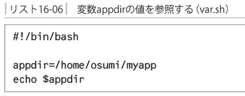

- 変数の書き方の注意

`変数に代入時に$は付けない。値を参照したい時だけ`

`=の前後にスペースを入れない`

`変数名に利用できる文字はアルファベットと数値と_(アンダースコア)だけ`

`変数名の区切りを明示する。{}で明示できる`

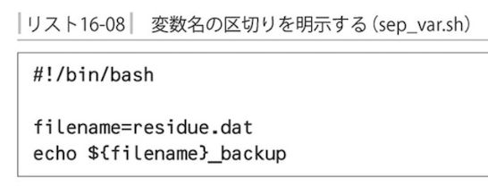

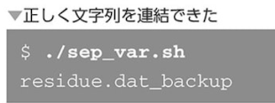

### クォーティング

`''`か`""`で囲むことによって`スペースも含めて１つの単語とみなされるよう`にできる

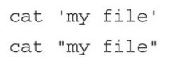

クォーティングすることでシェルによるスペースやメタ文字の解釈をさせず、まとめて一つの文字列として扱うことができる

- クォート中の変数展開

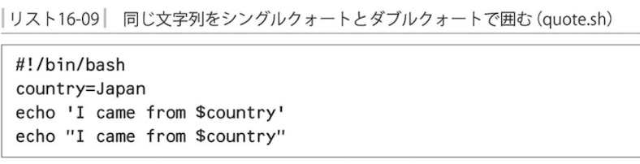

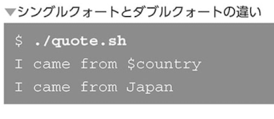

