### シェルスクリプトの活用

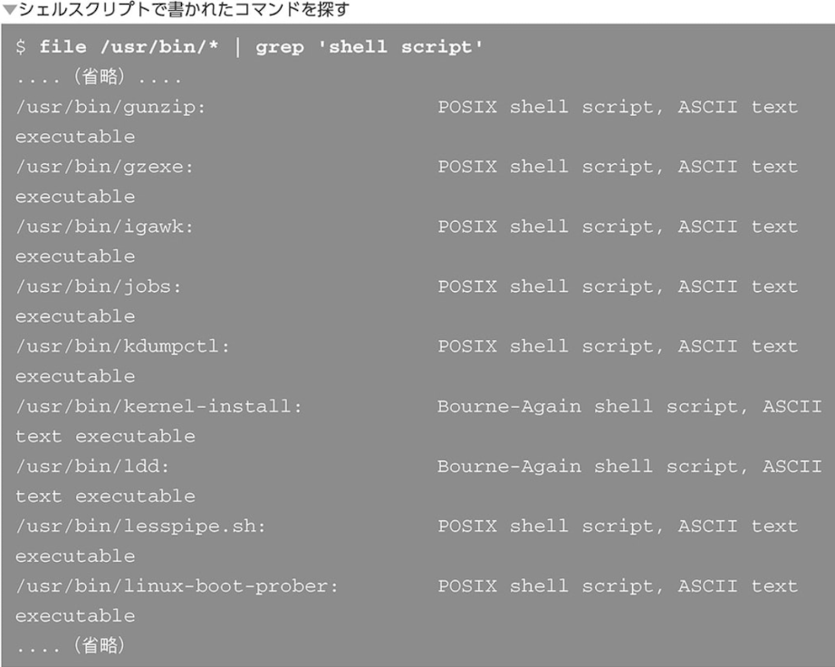

- シェルスクリプトの欠点

`大規模システムのプログラミング`

`高速性が必要な処理`

### 演習1　日記を書くためのシェルスクリプト

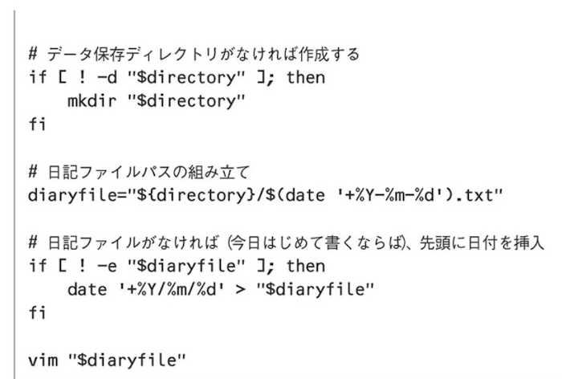

### 演習2 指定したパスは以下のファイル一覧表示

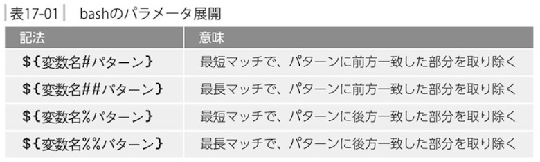

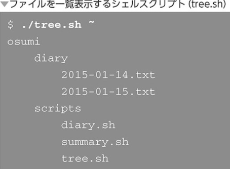

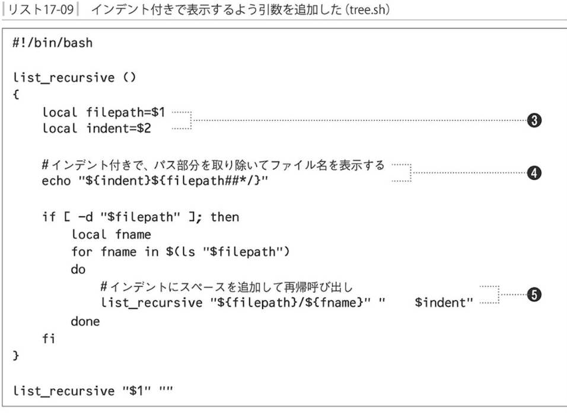

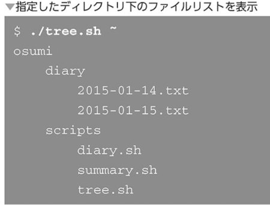

- IFS　内部フィールド区切り文字

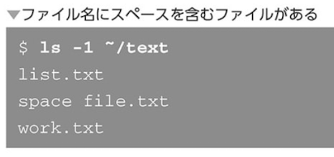

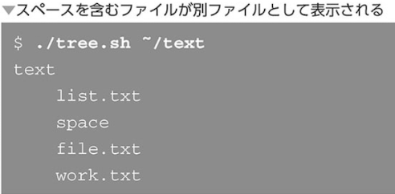

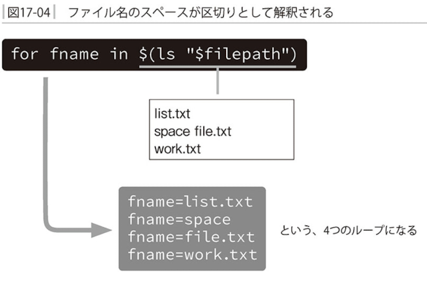

`スペースで区切らせないようにIFSの値からスペースを抜いておく`

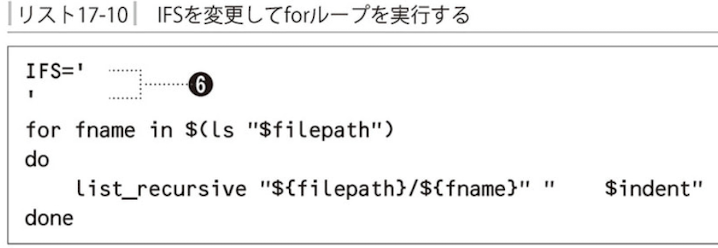

上では「IFS」に`改行`を代入しておく

- IFSのバックアップ

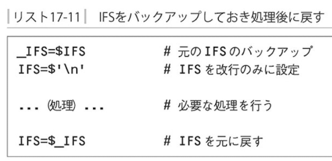

### 演習3 検索コマンド

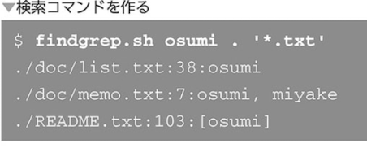

- xargsコマンド - 標準入力からコマンドラインを組み立てて実行する

xargsは標準入力として「引数リスト」を与えます

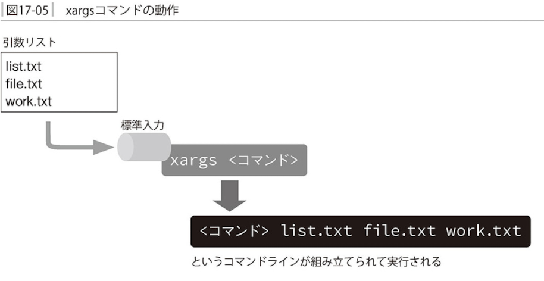

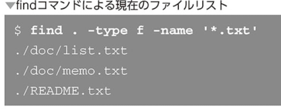

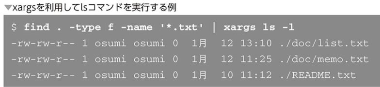

- xargsを利用してgrep

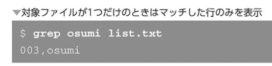

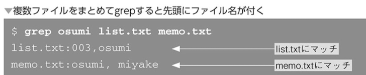

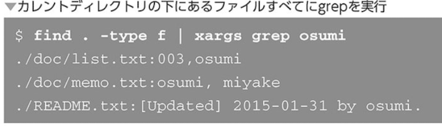

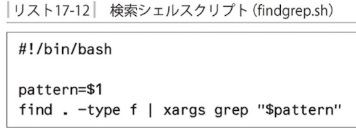

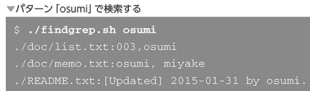

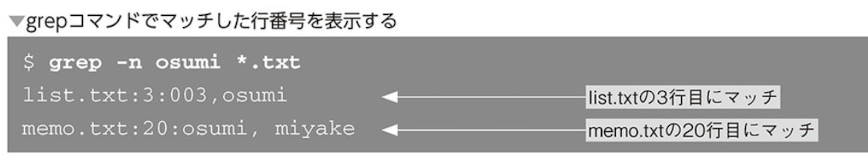

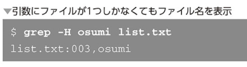

- 指定できる項目を増やして実用的に

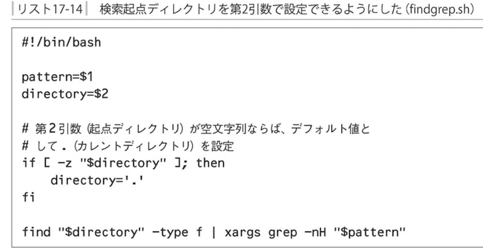

- ヘルプの表示

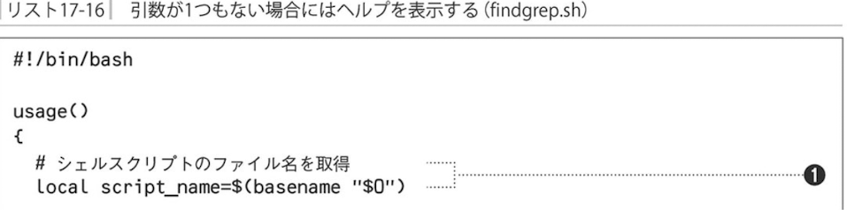

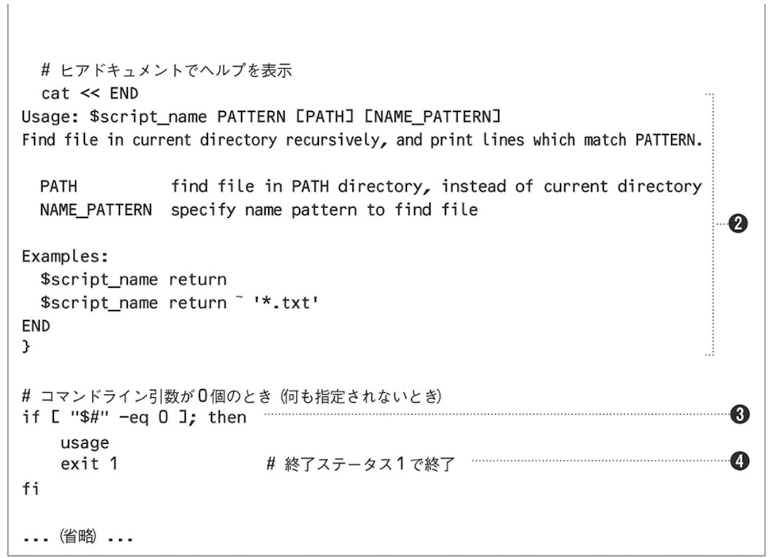

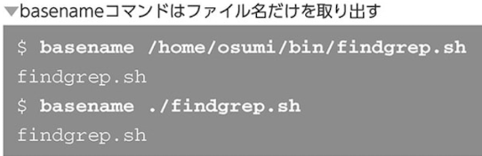

- エラーメッセージの表示

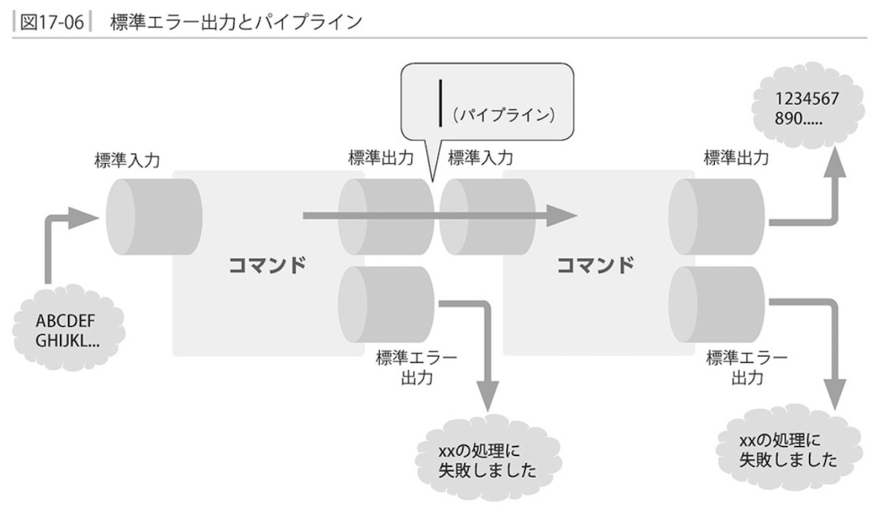

完成したシェルスクリプト「findgrep.sh」

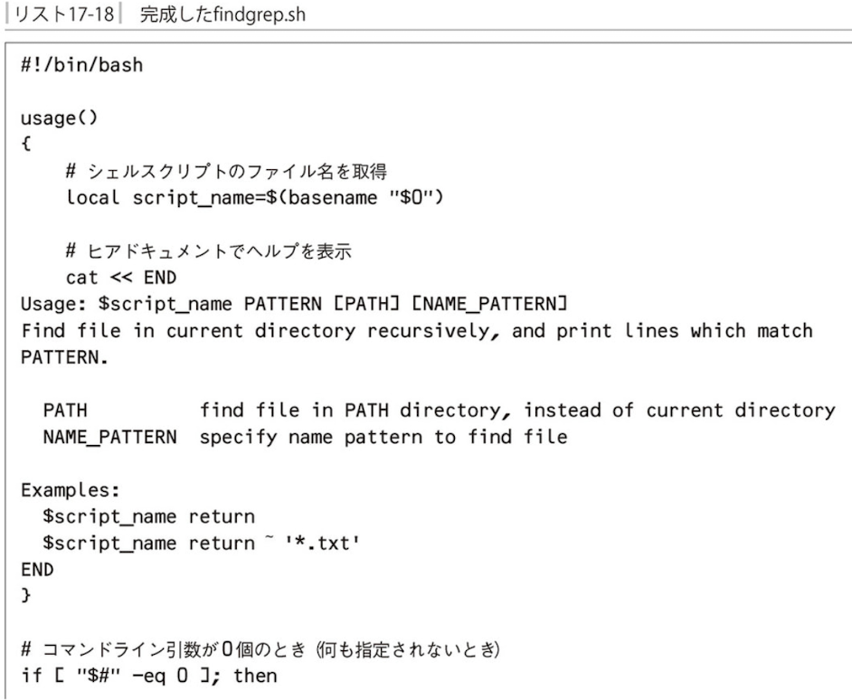

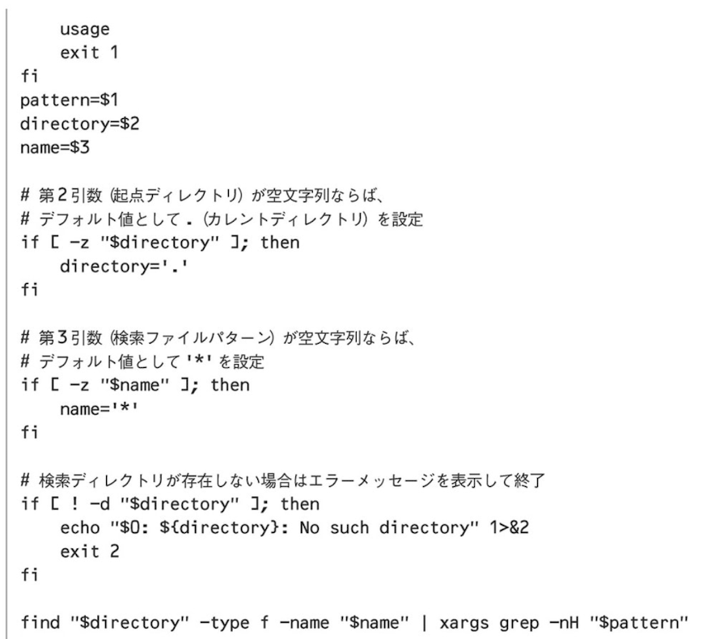

