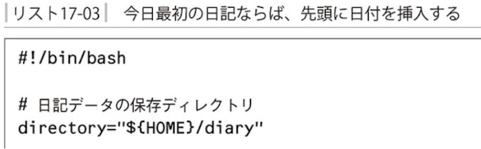
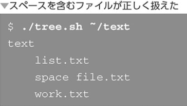
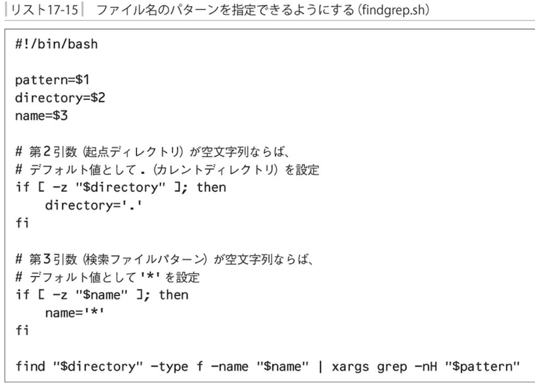
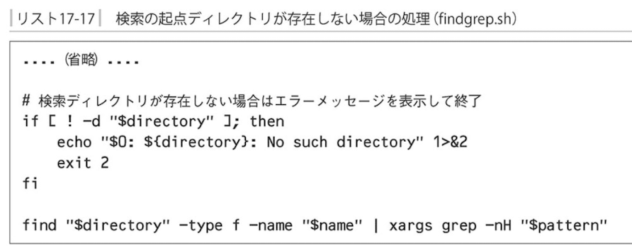

### シェルスクリプトの活用

- シェルスクリプトの欠点

`大規模システムのプログラミング`

`高速性が必要な処理`

### 演習1　日記を書くためのシェルスクリプト

### 演習2 指定したパスは以下のファイル一覧表示

- IFS　内部フィールド区切り文字

`スペースで区切らせないようにIFSの値からスペースを抜いておく`

上では「IFS」に`改行`を代入しておく

- IFSのバックアップ

### 演習3 検索コマンド

- xargsコマンド - 標準入力からコマンドラインを組み立てて実行する

xargsは標準入力として「引数リスト」を与えます

- xargsを利用してgrep

- 指定できる項目を増やして実用的に

- ヘルプの表示

- エラーメッセージの表示

完成したシェルスクリプト「findgrep.sh」

