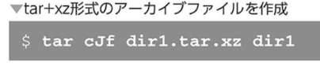

### アーカイブファイルと圧縮ファイル

複数のファイルやフォルダをまとめたファイルのことをアーカイブ（書庫）


### tarコマンド ファイルをアーカイブする

- まずは練習用ファイルの準備


- 余談、ブレース展開

```
{<開始位置>..<終了位置>}
```


- アーカイブファイルの作成

```
tar cf <アーカイブファイル> <アーカイブ元のファイルパス>
```


- アーカイブファイルの内容確認

```
tar tf <アーカイブファイル>
```


- アーカイブ展開

```
tar ｘf <アーカイブファイル>
```


- ファイルリストを表示するvオプション


- ファイル属性の保持

`ファイル属性もそのままアーカイブされる`

### gzipコマンド

ファイルを圧縮するコマンド

```
gzip <圧縮元>
```


- 標準出力にgzipファイルを出力


- tarとgzipを組み合わせる


- パイプとリダイレクトによるtar+gzファイルの作成


### bzip2コマンド

gzipコマンドよりもさらに圧縮率が高くデータ量をより小さくできる

```
bzip2 <圧縮元ファイル>
```


- tarとbzip2を組み合わせる

`tarでbzip2形式を利用するには、jオプションを利用`


- その他の圧縮形式

bzip2よりもさらに高圧縮率なのがxz形式



### zipコマンド

zipはファイルの圧縮とアーカイブを同時に行うコマンド
linuxではあまり使われないが,macOSやwindowsでよく使われる


- zipファイルの作成

```
zip -r <圧縮ファイル名> <圧縮対象パス>
```


-rオプションは指定したディレクトリ内のファイルをまとめて圧縮する

`zipファイルを作成するときは常に-rオプションを使った方がいい`


-qオプションを利用するとファイル名を表示しないようにする


- パスワード付きzipファイル


