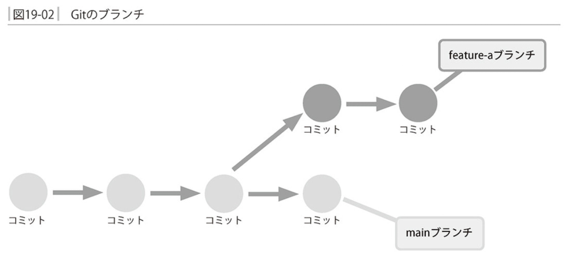
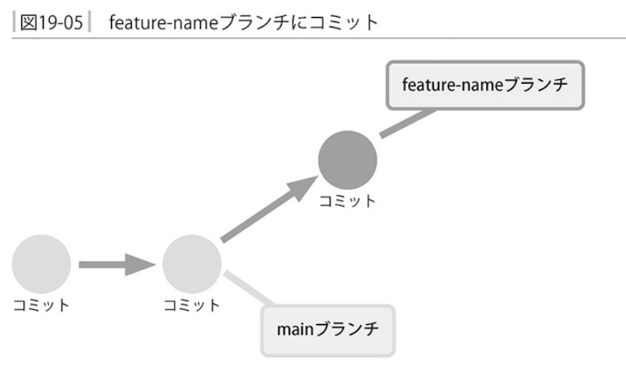

### バージョン管理システムとは

`ファイルの変更履歴を保存し管理するためのツール`

`ファイルに対して「いつ・誰がどんな目的で・どういう変更を加えたのか」記録して閲覧できるように`

`必要に応じてファイルを過去の状態に巻き戻す`

### Gitのインストールと初期設定


CentOS Streamの場合のgitインストール


Ubuntuの場合のgitインストール


- gitの初期設定


### 基本的な使い方

- リポジトリの作成


- リポジトリにファイルを追加する

addでリポジトリに履歴として追加


commmitでリポジトリに変更履歴を追加


- 差分の表示と再コミット


オプションをつけずにコミットすると自動でエディターが立ち上がりメッセージの追加を求められるので、書くこと


- 変更履歴を確認する


オブジェクト名は40文字もあるため、一意的に定まる位置で省略して良い決まりがある


### ワークツリーとインデックス


### コミットの単位とインデックス


### 誤りから復旧する

- ワークツリーに対する誤りからの復旧


- 誤ったコミットからの復旧

```
git revert <取り消したいコミットオブジェクト名>
```


### ブランチを使う




新しいブランチの作成

```
git branch <ブランチ名>
```


ブランチを切り替える

```
git switch <移動先ブランチ>
```





```
git merge <マージするブランチ名>
```


ブランチの削除

```
git branch -d <ブランチ名>
```


### リポジトリのバックアップを作成する


```
git push <送信先リポジトリ> <送信元ブランチ>:<送信先ブランチ>
```


リポジトリを複製する

```
git clone <複製元リポジトリ>
```


リポジトリに別名を設定

```
git remote add <別名> <リポジトリパス>
```

慣習として`origin`という名前が使われる


### 二人以上で作業する


共有リポジトリを経由して経由して全ユーザー間で変更の履歴を確認できる


リポジトリの変更を取り込む

```
git fetch <リポジトリ>
```


### 競合を解決する

競合をコンフリクト(conflict)と呼ぶ


### gitのマニュアル


