### パッケージとリポジトリ

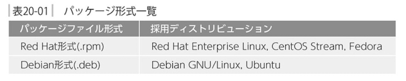

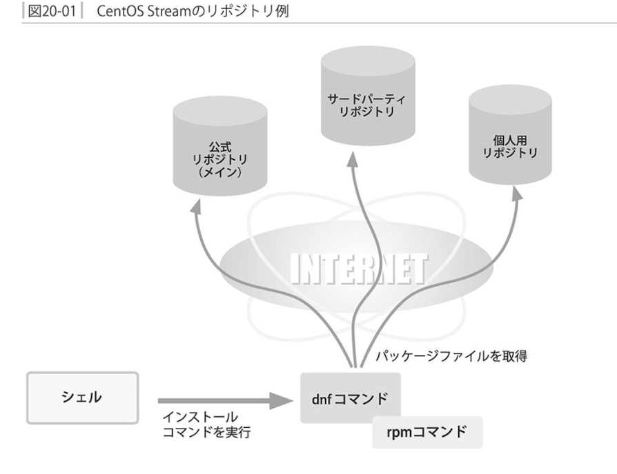

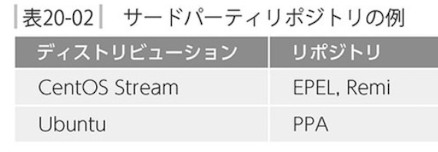

### dnfコマンド パッケージ管理

- 基本的な使い方

```
dnf [オプション] <コマンド> <パッケージ名>
```

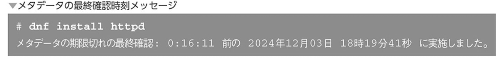

- パッケージのインストール

```
dnf install <パッケージ名>
```

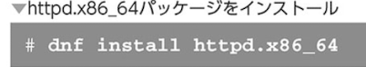

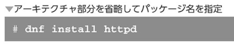

このあとパッケージのインストール確認画面に移行するのでyを押す
全てyで省略したい場合は下記

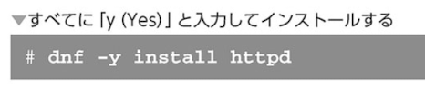

- パッケージ間の依存性

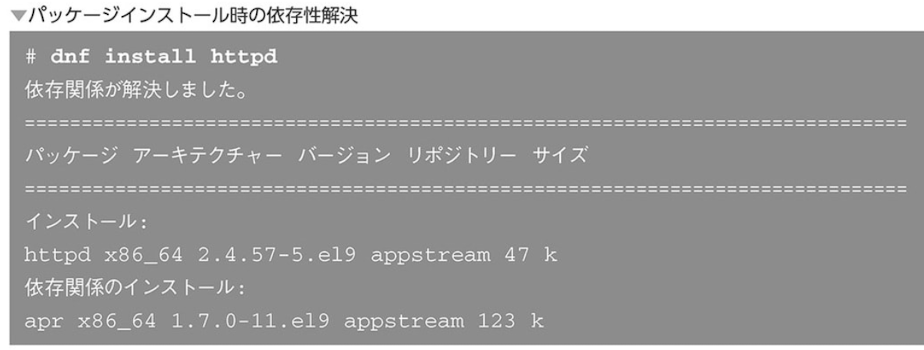

- パッケージの削除

```
dnf remove <パッケージ名>
```

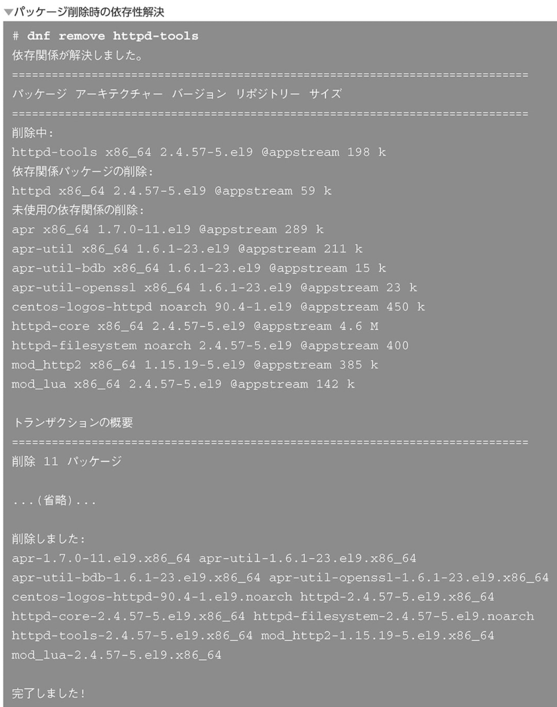

- パッケージを探す

```
dnf search <検索ワード>
```

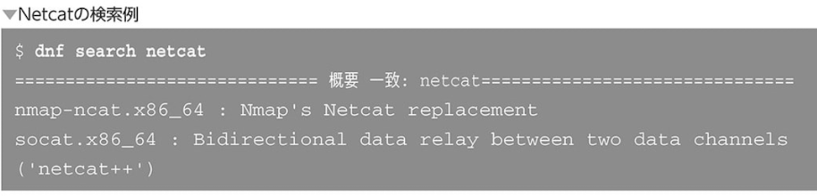

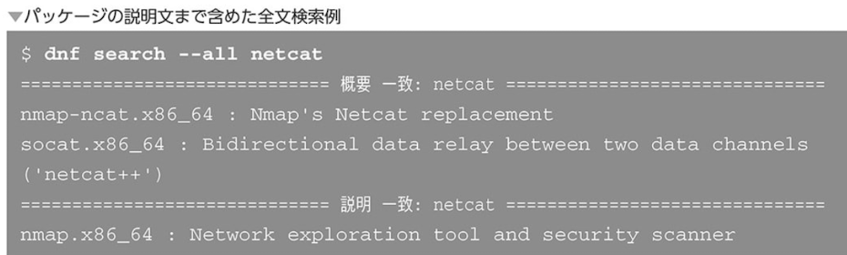

- パッケージ情報表示

```
dnf info <パッケージ名>
```

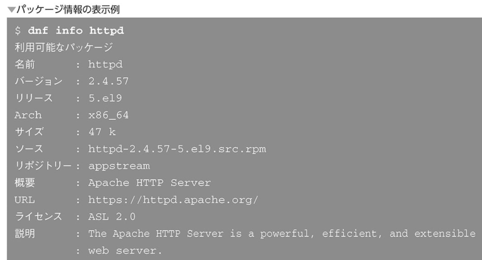

### aptによるパッケージ管理

```
apt [オプション] [コマンド] [パッケージ名...]
```

- パッケージのインストール

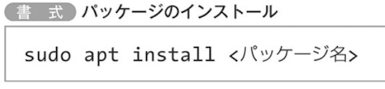


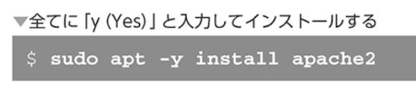

- パッケージ間の依存性

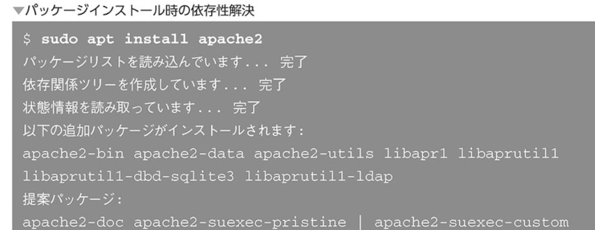


- パッケージの削除

```
sudo apt remove <パッケージ名>
```

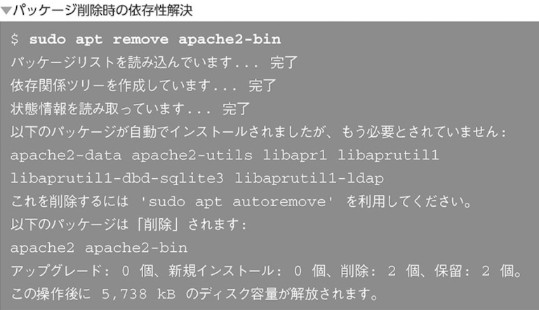

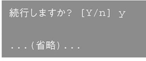


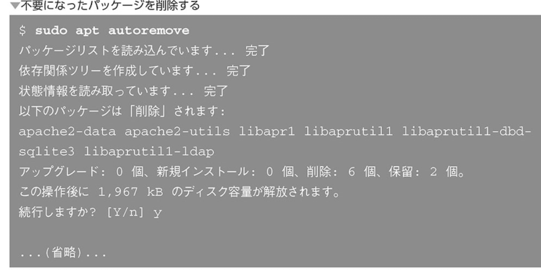

```
sudo apt purge <パッケージ名>
```

- パッケージを探す

```
apt serch <検索ワード>
```


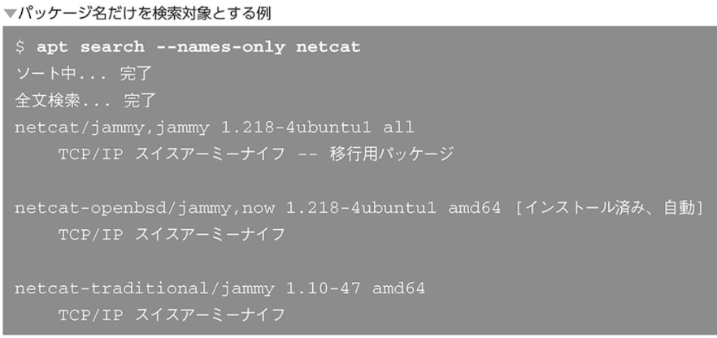

- パッケージの情報表示

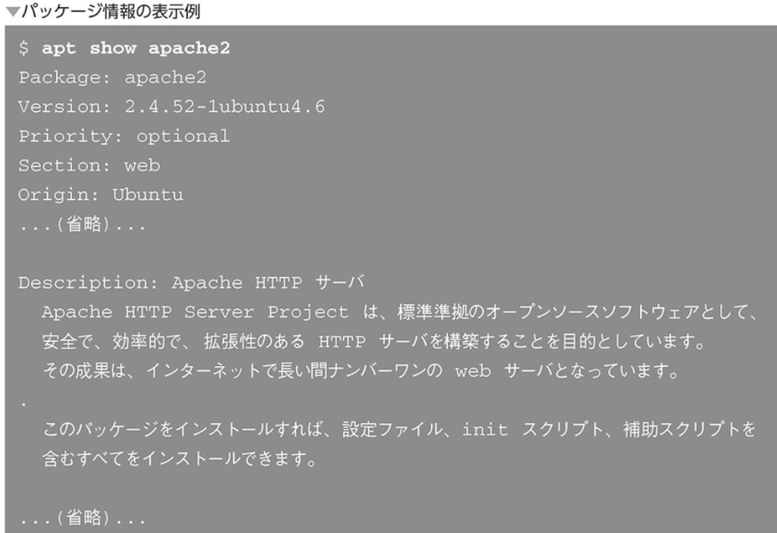

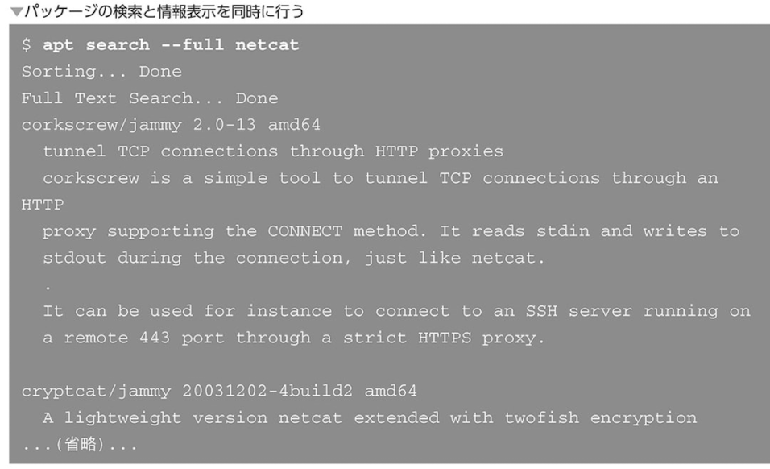

