### リモートログインとSSH

- SSH

sshとはリモートと通信するためのプロトコル

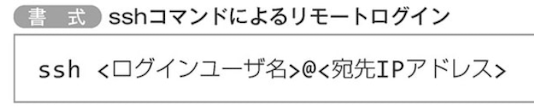

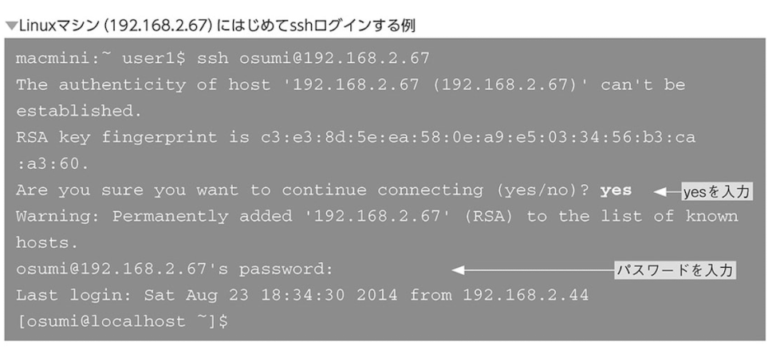

- VirtualBoxとssh接続

ポートフォワーティングの設定

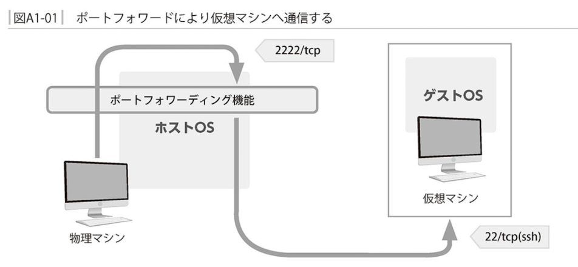

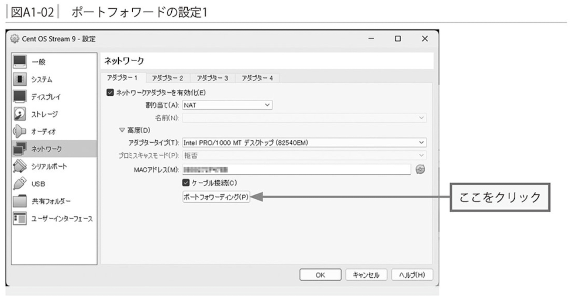

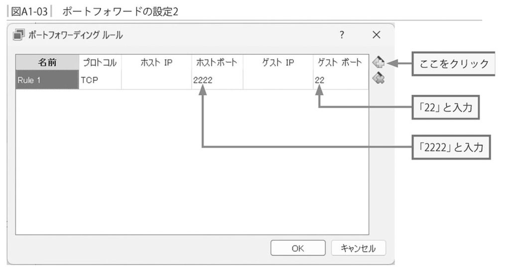

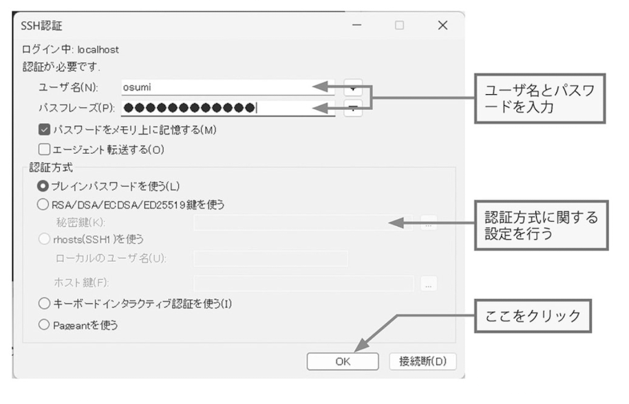

### infoドキュメントを読む

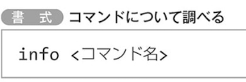

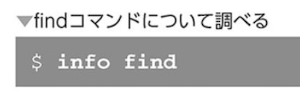

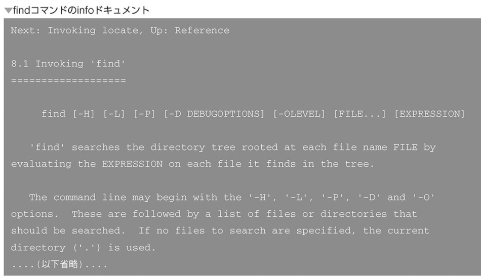

- ファイルとノード

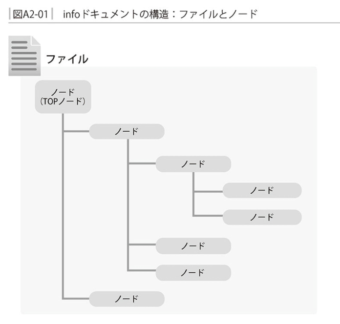

- ノードの階層構造

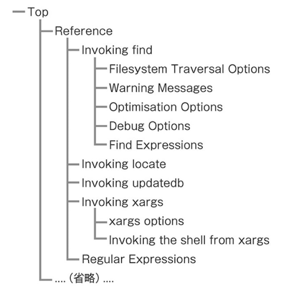

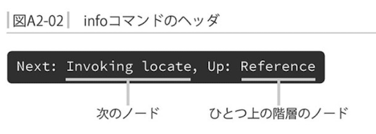

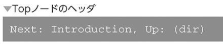

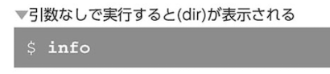

- ノードの移動

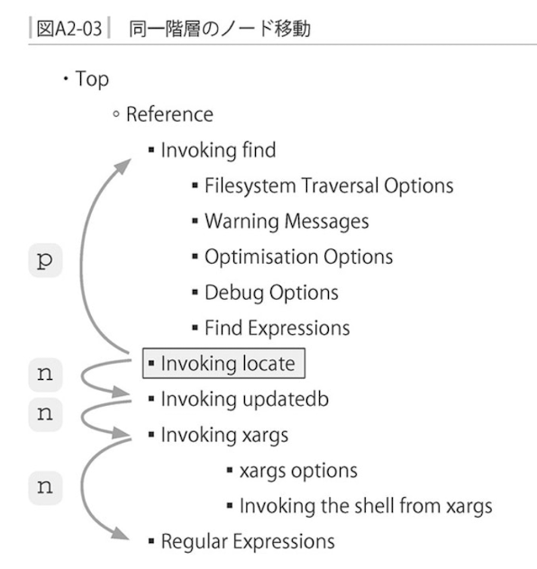

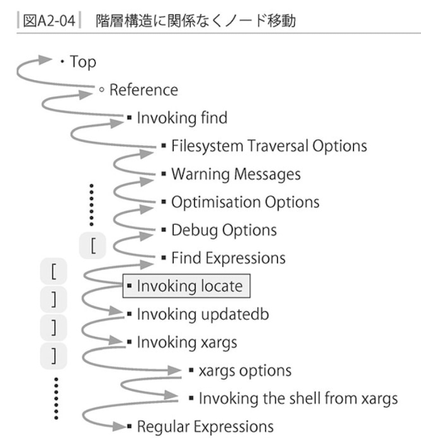

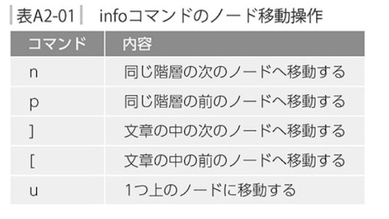

- スクロール

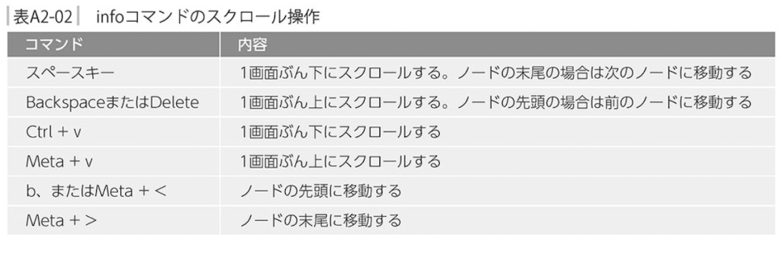

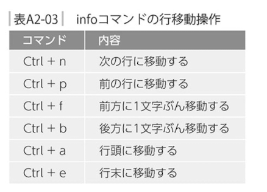

- リンク参照

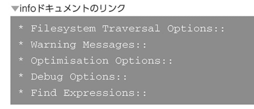

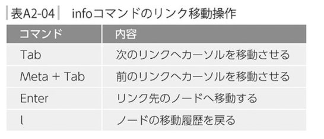

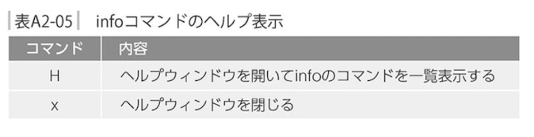

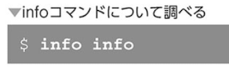

### Linuxでの日本語入力について

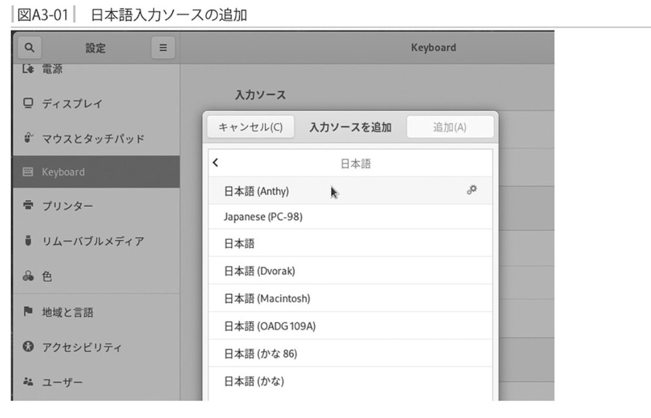

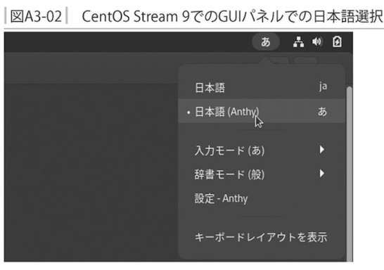

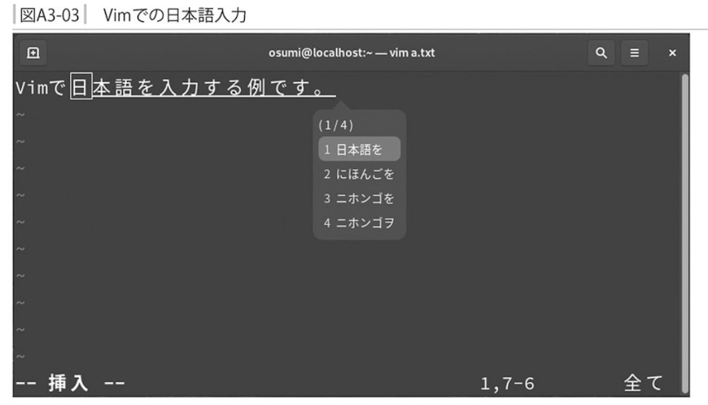

