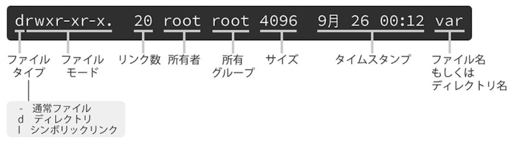

# Linuxはファイルからできている

Linuxで扱われるデータはファイルとして扱われる

### ディレクトリとは？
ディレクトリとはファイルを整理する入れ物のこと
一般的にはフォルダと呼ばれている

### Linuxのディレクトリ構造
一番上のディレクトリは「/」と表現されルートディレクトリと呼ぶ
Linuxのディレクトリ構成はルートディレクトリを頂点とした階層構造になっている
このような構造をツリーと呼ぶ

### パス
各ディレクトリを「/」で区切りあるディレクトリから目的のディレクトリまでの道筋を表現することを「パス」(path)と呼ぶ

### windowsとの違い

- Windowsも階層構造を持つが、物理デバイスが二つある場合は二つのディレクトリツリーを持つ。

- しかしLinuxは何台ディスクが当ても一つのディレクトリツリーしか持たない。
もし複数のディスクがある場合はルート配下のどこかのディレクトリにくっつける(マウント)する手法をとっている。

### 各ディレクトリの役割
ディストリビューションによって多少の違いはあるが、特に重要なものをここで解説

- /bin
Linuxシステムの動作に最低限必要な、重要度の高いコマンドを格納している。

- /dev
デバイスファイルを格納するディレクトリ。デバイスファイルとはキーボードなどのハードウェアをファイルとして扱えるようにした特殊なファイル。

- /etc
設定ファイルを置くためだけのディレクトリ。非常に重要

- /home
ユーザーごとに割り当てられる、ホームディレクトリが配置されるディレクトリ。
ユーザーの名前が例えばそのまま「home/username」という形で割り当てられて名前となっている。

- sbin
/binと似ており、実行ファイルを置くためのディレクトリ。
例えば「shutdown」コマンドなど

- /tmp
一時ファイルを置くディレクトリ
このファイル内は定期的に削除する設定となっているディストリビューションが多く、永続的な保存先としての使用はダメ

- usr
各種アプリケーションと、どれに付随するファイルを置くためのディレクトリ

- var
変化するデータ(variable)を置くディレクトリ。電子メールやアプリの動作ログなど。
容量が逼迫する危険性があり管理上は注意が必要

### カレントディレクトリとpwd
自分が現在位置しているディレクトリをカレントディレクトリという。
「pwd」コマンドでカレントディレクトリを確認することができる。

```
$ pwd
/home/user

```

### 絶対パスと相対パス

- 絶対パスとはルートディレクトリを起点としてファイルやディレクトリのパスのこと

- 相対パスとはカレントディレクトリを起点として表記されるパスのこと

Linuxではパスを書く時に一般的に「.」はカレントディレクトトリ、「..」は親ディレクトリを表現する

### ディレクトリの移動

|コマンド|内容|
|---|---|
|pwd|カレントディレクトリの表示|
|cd|カレントディレクトリを変更|
|ls|ディレクトリ内のファイルを表示|

- カレントディレクトリとCDコマンド
カレントディレクトリを変更するにはCDコマンドを使う

```
$ cd -p /use/local
  コマンド オプション コマンドライン引数

```

cdコマンドはディレクトリを移動しても、「移動しました」など余計なメッセージは一切表示しない
なのでpwdコマンドで確認するのが良い

- Tabキーによるパスの補完

Tabキーの補完機能はコマンドだけでなくパス名の補完にも利用できる。
例えばcd/usrに移動したい時は

```
$ cd /u  # ここでTabキーを押す

$ cd /usr/ # このように補完される

```

- ホームディレクトリとチルダ展開
引数をつけずにcdコマンドを使うとホームディレクトリへ移動する

```
$ pwd
/usr/lib

$cd

$ pwd
/home/user
```

またこの他にもホームディレクトリへ戻るには「~(チルダ)」を使う方法もある

```
$ cd ~
```

### lsコマンド

- lsコマンドはファイルやディレクトリを一覧表示するコマンド

```
$ ls /
bin   dev   home   ...
....
```

引数としてファイルを指定してコマンド実行すると

```
$ ls /bin/cp
/bin/cp
```
存在しない場合は「そのようなファイルやディレクトリはありません」と表示される

複数のディレクトリを指定することも可能

```
$ ls / /usr
/:
bin   dev   home   ...
....
/use:
bin   game   lib   ...
....
```

なおlsコマンドはファイルが一つもない場合は何も表示されない

### *と?

|コマンド|内容|
|---|---|
|*|任意の文字列|
|?|任意の１文字|

baで始まるファイル一覧

```
$ ls ba*
base64   basename
```

拡張子がhtml

```
$ ls *.html
about.html   index.html  ....
```

- 「ba??」と入力すると「ファイル名がbaで始まり4文字で終わる」ファイル名

```
$ ls ba??
bash
```

### lsコマンドのオプション

```
$ ls -l

```




ファイルタイプが「-」なら通常ファイル
「d」はディレクトリ

- ls -aオプション

```
$ ls -a
```


- ls -F オプション

ファイル名の後ろにファイルの種類を示す記号を追加する

```
$ ls -F
```


- - Fオプションで表示されるファイル種別


### コマンドのオプションについて

コマンドのオプションは二つ以上指定することも可能

```
$ ls -a

$ ls -a -F
```


