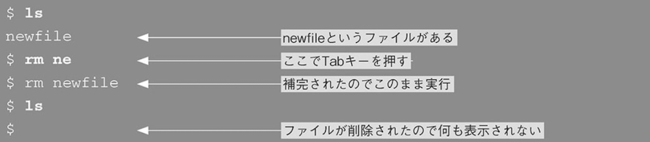
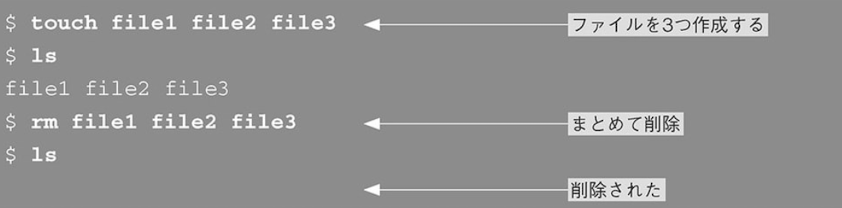
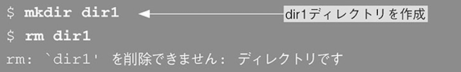
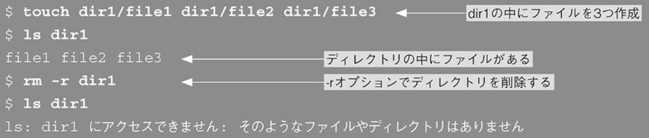

# 「mkdirコマンド」

- ディレクトリを作成する

```
$ mkdir [オプション] <作成するディレクトリ名>
```

```
$ mkdir work
```

- ちなみにすでに存在しているファイル名と同じ名前のディレクトリは作れない。


- 深いディレクトリを一気に作成する

深いディレクトリを作りたい時、指定したパスの途中のディレクトリが存在しない場合はエラーとなる


この場合は-pオプションを使う


### touchコマンド

- ファイルを作成する

```
$ touch <新しいファイル名1> <新しいファイル名2>
```


### rmとrmdirコマンド

- ファイルを削除する

```
$ rm [オプション] <削除するファイル名1> <削除するファイル名2>
```



- 複数のファイル削除



- ディレクトリの削除
普通のrmコマンドではエラーとなり消せない。



この場合は再起的にディレクトリを削除する`-rオプション`を指定する。



ディレクトリの削除を行う場合は必ずその中に必要なファイルが残ってないか確認すること。

