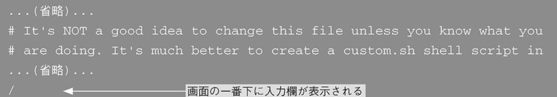

# 「mkdirコマンド」

- ディレクトリを作成する

```
$ mkdir [オプション] <作成するディレクトリ名>
```

```
$ mkdir work
```

- ちなみにすでに存在しているファイル名と同じ名前のディレクトリは作れない。


- 深いディレクトリを一気に作成する

深いディレクトリを作りたい時、指定したパスの途中のディレクトリが存在しない場合はエラーとなる


この場合は-pオプションを使う


### touchコマンド

- ファイルを作成する

```
$ touch <新しいファイル名1> <新しいファイル名2>
```


### rmとrmdirコマンド

- ファイルを削除する

```
$ rm [オプション] <削除するファイル名1> <削除するファイル名2>
```


- 複数のファイル削除


- ディレクトリの削除
普通のrmコマンドではエラーとなり消せない。


この場合は再起的にディレクトリを削除する`-rオプション`を指定する。


ディレクトリの削除を行う場合は必ずその中に必要なファイルが残ってないか確認すること。

- 削除前の確認
削除前の確認を必ず行いたい場合は`-iオプション`を指定する

```
$ rm -i file1
rm: 通常の空のファイル `file1`を削除しますか？
```

- 空のディレクトリを削除する

rmdirコマンドは空のディレクトリを削除するコマンド
中にファイルがあるディレクトリを削除しようとするとエラーとなる。

```
$ rmdir <ディレクトリ名>
```


隠しファイルが残っている場合は削除できないので、注意。


### catコマンド

ファイルの内容を表示する

```
$ cat [オプション] <ファイル名>
```


- ファイルを連結して表示する

```
$ cat <ファイル名> <ファイル名2>
```


- 行番号を表示する

```
$ cat -n <ファイル名>
```


- ファイル名を指定しない場合

何か入力してエンターを押すと入力内容が表示される


このモードを抜ける場合は「Ctrl + d」を入力する。

### lessコマンド

```
$ cat <オプション> <ファイル名>
```

catコマンドの場合は、ファイルの内容が長かった場合、一画面に表示しきれない。
長い内容のファイルを見たい場合は「less」コマンドを使う
ファイル内容が長い場合は一画面に表示して、スクロールして見ることができる

- lessコマンドのスクロール操作


- ファイル内検索
lessコマンドでは現在開いているファイルから文字列を検索できる

ファイル表示中に「/」を押す



- etcという文字列を検索する場合


自動でetcと書かれている箇所までスクロールされて止まる

- lessコマンドの検索操作


### cpコマンド

```
$ cp <オプション> <コピー元> <コピー先>
```


- ファイルを「dir1」ディレクトリへコピーする場合


- パス名展開を使った複数ファイルのコピー


