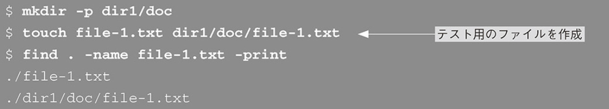

### ファイルを探す

- findコマンド- ディレクトリツリーからファイルを探す

```
find <検索開始ディレクトリ> <検索条件> <アクション>
```

- findコマンド例


アクションにprintを指定することで検索結果を表示することができる

- 以下のようにすることで指定したディレクトリ直下だけでなく、ディレクトツリーを下り、一致するファイル全てを表示する。



- ファイル名で探す場合は「name」か「iname」で探す。
ちなみに「*」か[?]を含む単語は''か""で囲む

```

```