### ファイルを探す

- findコマンド- ディレクトリツリーからファイルを探す

```
find <検索開始ディレクトリ> <検索条件> <アクション>
```

- findコマンド例


アクションにprintを指定することで検索結果を表示することができる

- 以下のようにすることで指定したディレクトリ直下だけでなく、ディレクトツリーを下り、一致するファイル全てを表示する。


- ファイル名で探す場合は「name」か「iname」で探す。
ちなみに「*」か[?]を含む単語は''か""で囲む

```
find . -name '*.txt' -print
```

- ファイルの種類で探す


カレントディレクトリの下にあるディレクトリを列挙


ー複数の検索条件を-aで指定


- Locateコマンド・ファイル名データベースからファイルを探す

locateコマンドはパスの一部を検索してファイルを探すコマンド

```
locate [オプション] <検索パターン>
```

「bash」という文字列を含むパス名を検索


拡張子.sedのファイルを検索


大文字小文字を区別しない


ファイル名だけを対象に検索

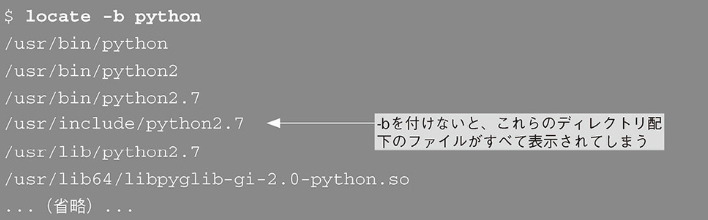

複数の検索条件を指定してOR検索


複数の検索パターンを含むようAND検索


### コマンドの使い方を調べる

- --helpオプション

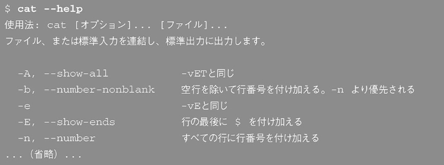


- manコマンド - マニュアルを表示する

コマンドについて調べる

```
man <調べたいコマンド>
```

- man catの実行結果


manの各項目


キーワードで調べる

```
man -k <キーワード>
```


()内の数字はセクション番号である
下記は各セクション番号の意味

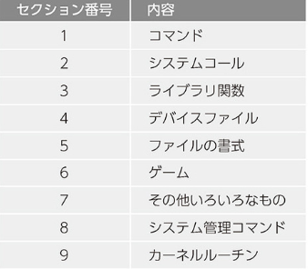


セクジョンで調べる

```
man <セクション番号> <名前>
```


セクション番号のリスト表示

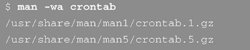

## helpコマンド - bash組み込みコマンドの使い方を表示する

manでも全てのコマンドのマニュアルが表示できるわけではない
例えばmanコマンドではcdコマンドのマニュアルは表示できない
cdのようなbash・シェルの中に含まれている組み込みコマンドはhelpコマンドで探すのが便利
bashの組み込みコマンドのマニュアルはman bashで探すと文章量が多く、該当の章を探すのに苦労する

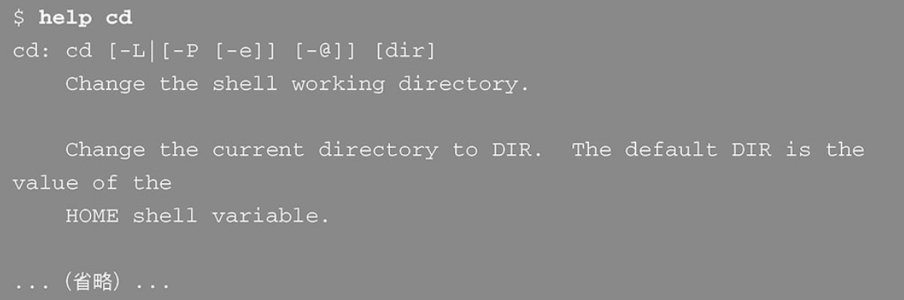

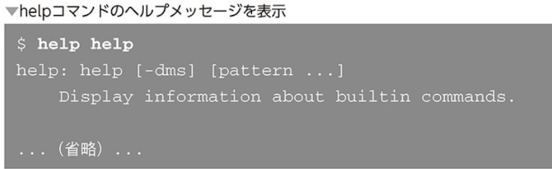

### コマンドを探す

- whichコマンド - コマンドのフルパスを表示する

例：catコマンドのありか

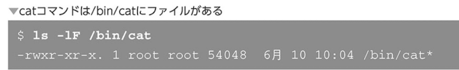

catコマンドは通常「bin/cat」と入力しないと実行できないが、これまで何度も実行できている。
その理由は$PATHという環境変数に設定された場所から自動的にコマンドを探してきてくれるため
単にコマンドを探す場所がシェルに設定されていると覚えておけば良い

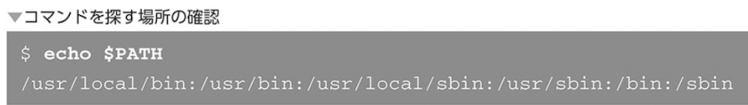

catコマンドを実行した際のシェルの実行プロセス
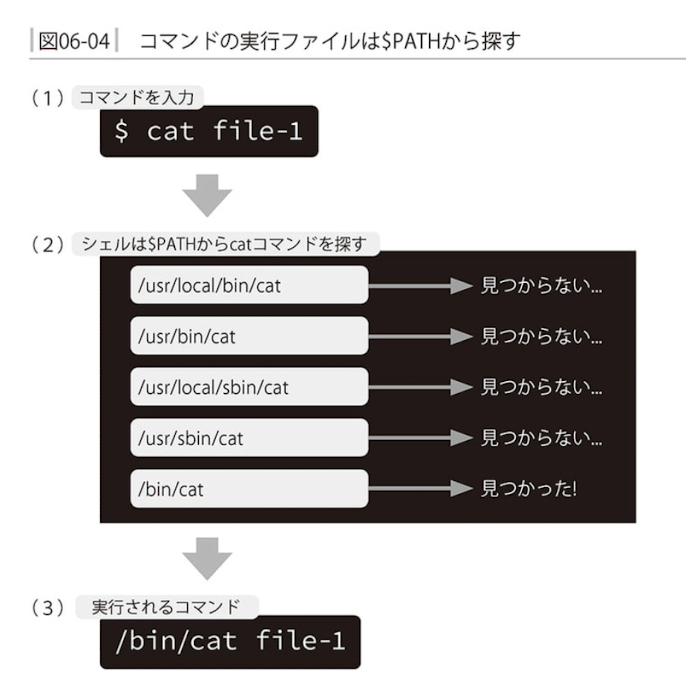

- コマンドを実行する際にシェルがどのファイルを実行するのか確認したい場合はwhichコマンドを使用する

```
which [オプション] <コマンド>
```

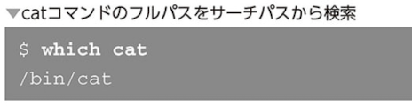

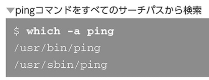

### 日本語ドキュメントと英語ドキュメント

catコマンドを使用して日本語・英語を明示的に使用してhelpを表示したい時

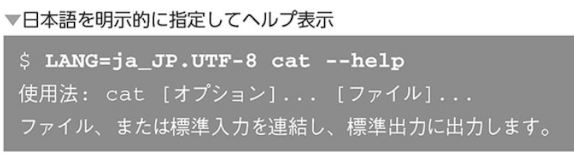

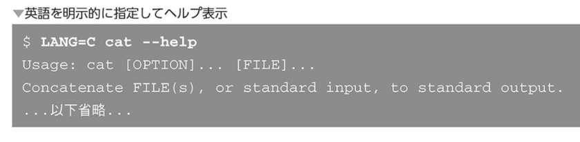


