### テキストファイルとバイナリファイル

ファイルは大きく分けてテキストファイル・バイナリファイルに分けることができる


バイナリファイルとは画像ファイルや音声ファイル、Linuxコマンドの実行ファイルなど、人間が読むことを考慮していないファイル


Linuxでは設定ファイルやアプリケーションのデータファイルは主にテキストファイルを使っている。
なぜなら
- 専用のアプリを使わなくても内容を理解できる
- 互換性が高く、1つのファイル形式を別のアプリケーションで使い回ししやすい
- Linuxにはテキストファイルを扱うためのコマンドが多く用意されており、それらの恩恵を受けられる

### Vim

Linuxのテキストエディターのこと
vimを使うためにはまずインストールする必要がある

- vimのインストール


vimのインストール確認


vimの起動
```
$ vim
```

- vimの起動画面


vimの終了コマンド(「:q」を入力してエンター)

```
:q <Enter>
```
vimが終了してシェルに戻る


### ファイルを開く/保存する

- ファイルを開く

```
vim 目的のファイル名
```


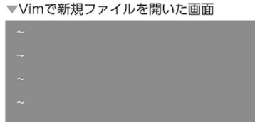

vimではファイルの終わり以降何もない部分の行頭をチルダ(~)で表現する

- ファイルの保存
```
:w
```

先ほどの上記ファイルが作成される

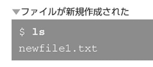

保存しないでvimを終わらせようとするとエラーになる


上書き保存したくない場合は「:q!」で終了
```
:q!
```

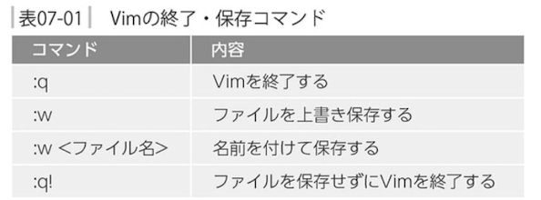

### 「Vim」の編集操作

- カーソル移動

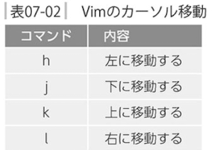

- 文字の削除
文字の削除は「x」を押す
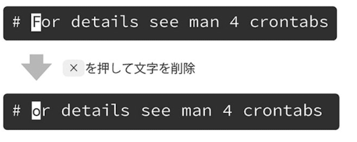

- 文字の入力

文字を入力するためには「i」を押してインサートモードにすること

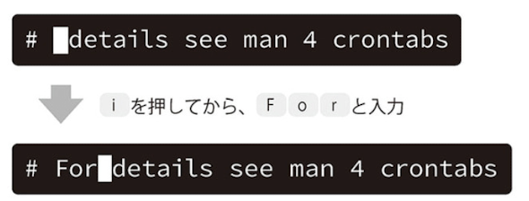

インサートモードを解除するには「escキー」を押す

iコマンドの後に入力した文字はカーソルの左側に入力される
カーソルの右側に入力したい場合は「a」を押す
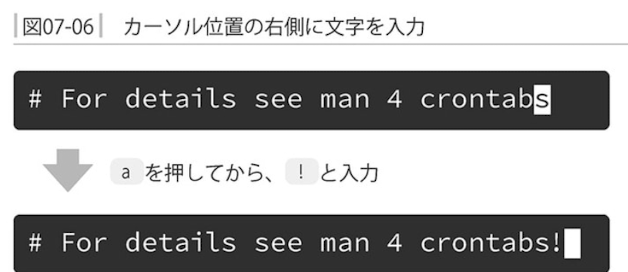

vimの基本コマンド

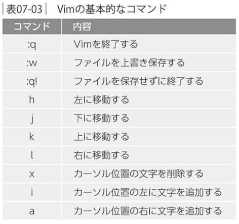

###　便利なカーソル移動

- 単語単位でのカーソル移動

単語単位でのカーソル移動は、次の単語への移動は「w」を押す。前の単語へは「b」を押す

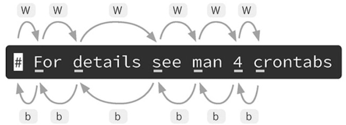

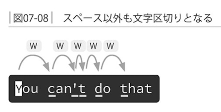

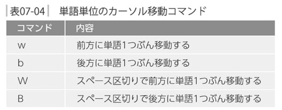

- 行頭/行末への移動
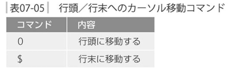

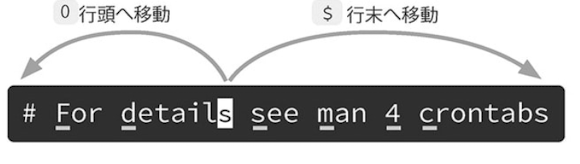

- 行番号での移動

例えば「<行番号>G」と入力すると指定した行番号へジャンプできる
「100G」だと100行目へジャンプ。
Gは大文字だから注意。

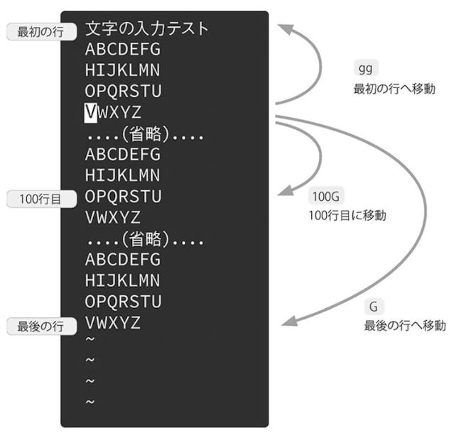

ファイルの再序の行へは`gg`、ファイルの最後の行へは`G`でジャンプできる

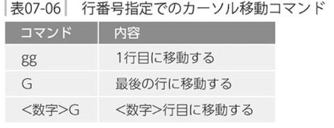

### カット、コピー、ペースト

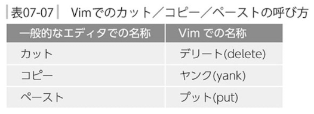

- デリート

dコマンドを利用するが以下の表の通り今までと使い方が異なる
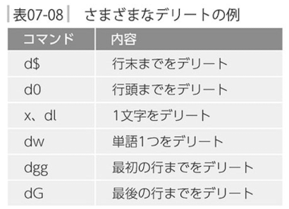

- プット
上のdコマンドでデリートした文字はpを使って貼り付けることが可能。
カットとプットを組み合わせてコピー＆ペーストができる
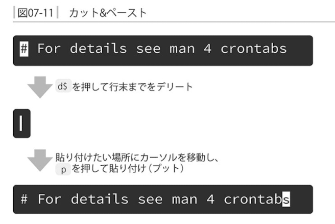

- ヤンク

コピー(ヤンク)したい場合はdではなく、yを押す。
上記のデリートコマンドの「d」を全てyで置き換えれば、そのまま同じように使える
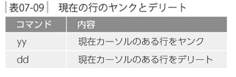

- 下の行と連結する
行を連結するのは「J」コマンド
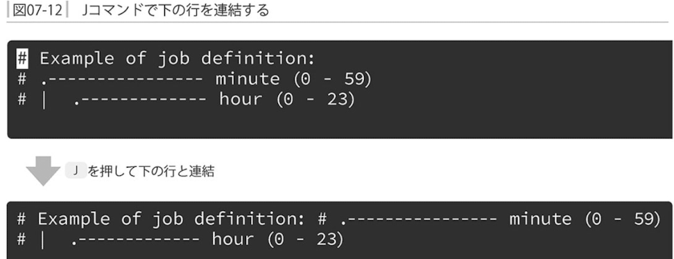

- アンドゥ(元に戻す)とリドゥ(やり直し)(undo)

直前の操作を取り消して戻るには「u」(アンドゥ)
アンドゥの取り消しは「Ctrl + r」(「リドゥ(redo)」)

### 検索と置換

- 検索

vimでは現在開いている文字列の検索ができる
「/検索したい文字列」

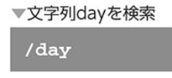

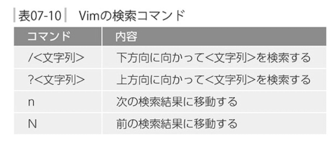

- 置換

```
%s/<置換文字列>/<置換後文字列>/g
```

「day」という文字列を「pen」へ変更している
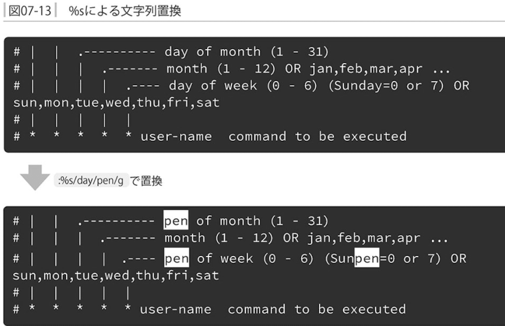

### ヘルプとドキュメント

「vimtutor」と入力するとチュートリアルがはじまる

vimtutorの起動
```
$ vimtutor
```
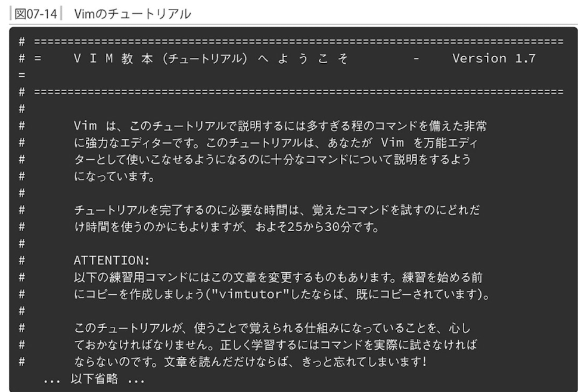