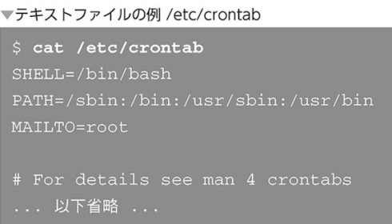
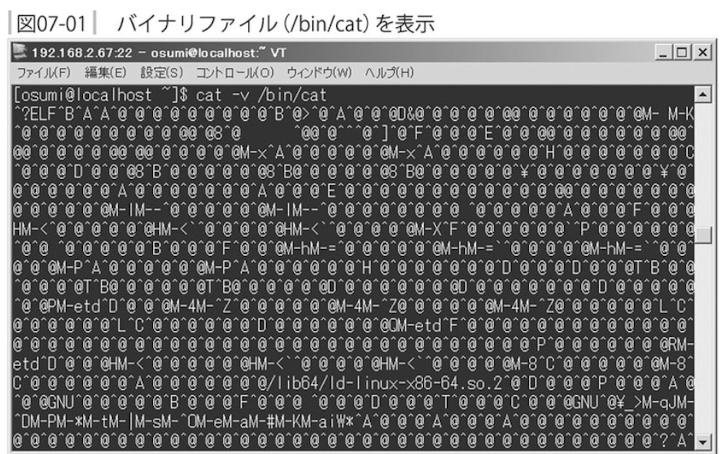
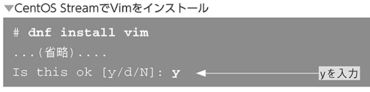
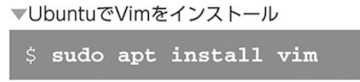
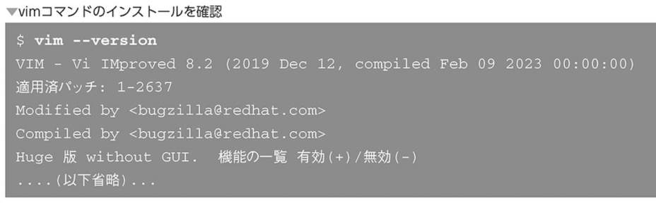
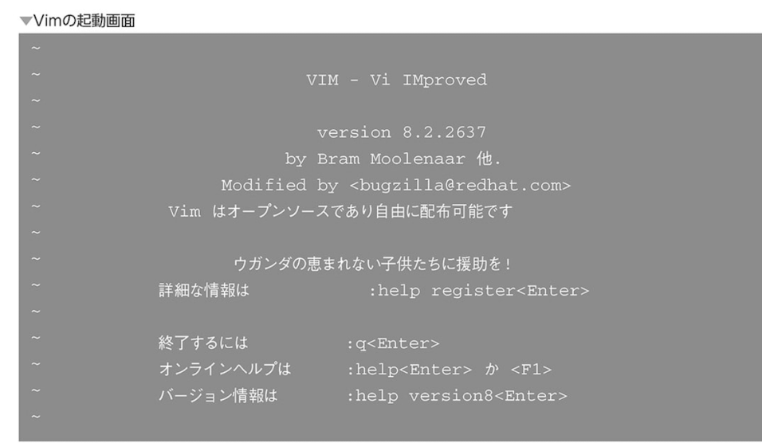

### テキストファイルとバイナリファイル

ファイルは大きく分けてテキストファイル・バイナリファイルに分けることができる



バイナリファイルとは画像ファイルや音声ファイル、Linuxコマンドの実行ファイルなど、人間が読むことを考慮していないファイル



Linuxでは設定ファイルやアプリケーションのデータファイルは主にテキストファイルを使っている。
なぜなら
- 専用のアプリを使わなくても内容を理解できる
- 互換性が高く、1つのファイル形式を別のアプリケーションで使い回ししやすい
- Linuxにはテキストファイルを扱うためのコマンドが多く用意されており、それらの恩恵を受けられる

### Vim

Linuxのテキストエディターのこと
vimを使うためにはまずインストールする必要がある

- vimのインストール





vimのインストール確認



vimの起動
```
$ vim
```

- vimの起動画面



vimの終了コマンド(「:q」を入力してエンター)

```
:q <Enter>
```
vimが終了してシェルに戻る