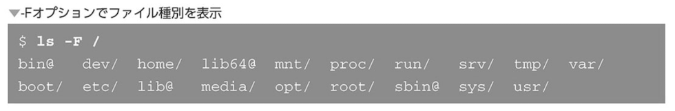
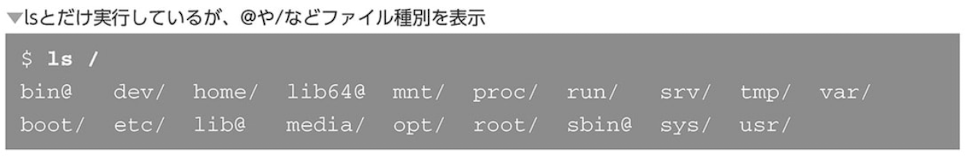
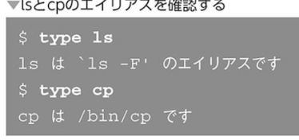
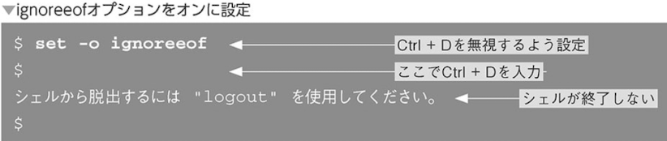
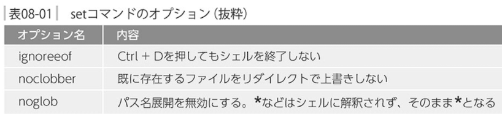
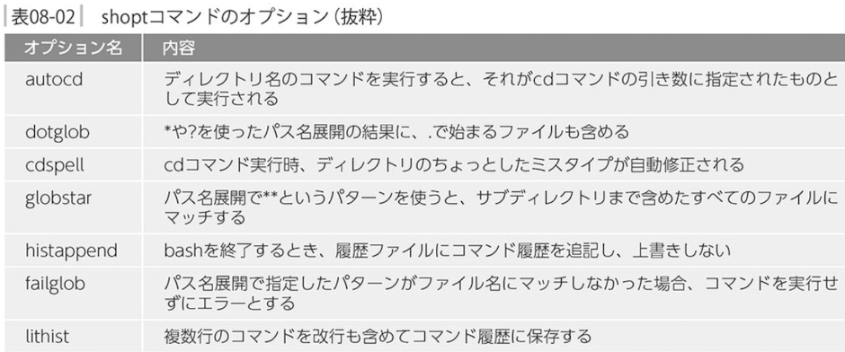

# エイリアス

エイリアスとは既存のコマンドに別名をつけて実行できるようにカスタマイズできるようにすること

ls -F オプションの挙動



ls -Fオプションのエイリアスの設定
```
$ alias ls='ls -F'
```

エイリアス設定後の実行結果



エイリアスを設定する方法
```
alias <名前>='<コマンド>'
```

- エイリアスの確認と削除


- エイリアスの削除
```
$ unalias ls
```

### エイリアスを一時的に無効にする

一時的にエイリアスを無効にする方法は3通りある

- フルパスで指定する
```
$ /bin/ls
```

- commandを使う
```
$ command ls
```

- /を先頭につける
```
$ /ls
```

# bashのオプション
bashではシェルが持つ様々な機能を利用するためにオプションを指定することができる。
オプションは一つの機能につきオン/オフで有効・無効の切り替えができる

- setコマンド
```
set -o/+o <オプション>
```
-oでオプションがオン。+oでオプションがオフ






- shoptコマンド

```
shopt -s/-u <オプション名>
```

-sで指定したオプションをオン、-uで指定したオプションをオフ
オプション名はsetでしているものとは異なる



### シェル変数