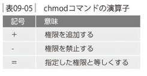
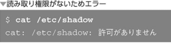

### ファイルオーナーとグループ

ファイルにはオーナーが設定されている


- グループ
グループとはユーザーをまとめた集まりのこと


### ファイルのパーミッション
主に「誰にどのような操作を許可をするか」という権限設定


- ディレクトリのパーミッション


それぞれの記号はファイルの場合とは違った意味を持つ


ファイルの削除ができるかどうかはディレクトリのパーミッションで決まる


- chmodコマンド - ファイルモードを変更する

```
chmod [ugoa] [+-=] [rwx] <ファイル名>
```




オーナーの書き込み権限を追加
```
$ chmod u+w file.txt
```


グループの書き込み権限を削除
```
$ chmod g-w file.txt
```


複数のユーザーの権限をまとめて指定
```
$ chmod go=r file.txt
```


- 数値モード
数値モードによるパーミッションの変更
```
$ chmod <8進数の数値> <ファイル名>
```
数値モードは`元のパーミッションに関わらず新しいパーミッションの値へと変更する`


例：「rw-r--r--」へのパーミッション変更は「644」


### スーパーユーザー

スーパーユーザーは別名`「rootユーザー」`

- suコマンド - ユーザーを変更する

suコマンドは主にスーパーユーザーに変わるために使う


スーパーユーザーから一般ユーザーへ戻るにはexitを使う

スーパーユーザーへ初期化して切り替えるには以下のコマンド
```
$ su -
```

スーパーユーザーは主にスーパーユーザーでないと実行できないコマンドを実行するために使用する

以下の場合はsudoコマンドを実行


スーパユーザーとしてコマンドを実行する
```
sudo <実行したいコマンド>
```


- sudoコマンドの設定
あるユーザーにsudoコマンドが使えるように設定したい場合は`/etc/sudoers`ファイルで甘露されているので編集する


例えば以下のよううに設定されている箇所がある


「osumi」というユーザーにsudo権限を追加したい場合は以下を追記
```
osumi ALL=(ALL) ALL
```

- visudoコマンド - sudoersファイルを編集する
`直接テキストエディタで開いて編集はNG`
編集間違いがあった場合sudoコマンドが二度と使えなくなる
なので`visudoコマンド`という特別なコマンドを使う

sudoersファイルの編集手順


- suとsudoのどちらを使うか
sudoの方が必要に応じて一つだけコマンドを実行するという形式となっているので`sudo`の方がよく使われる
